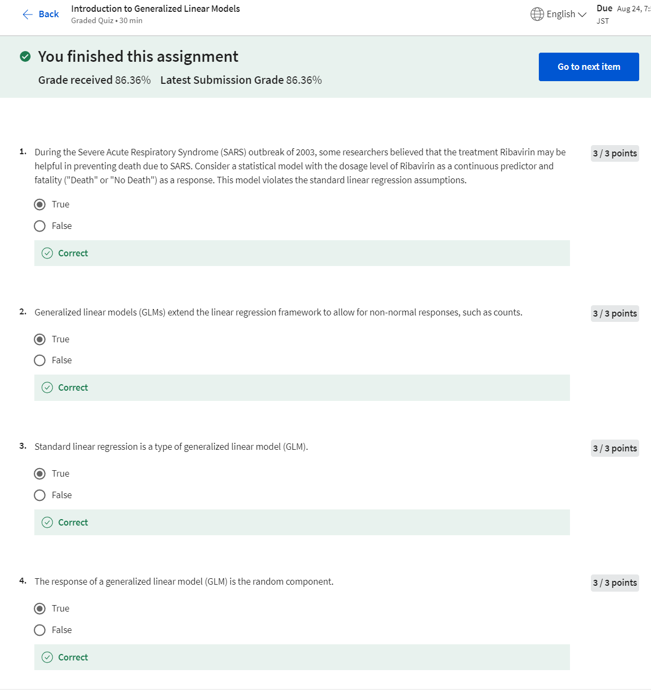
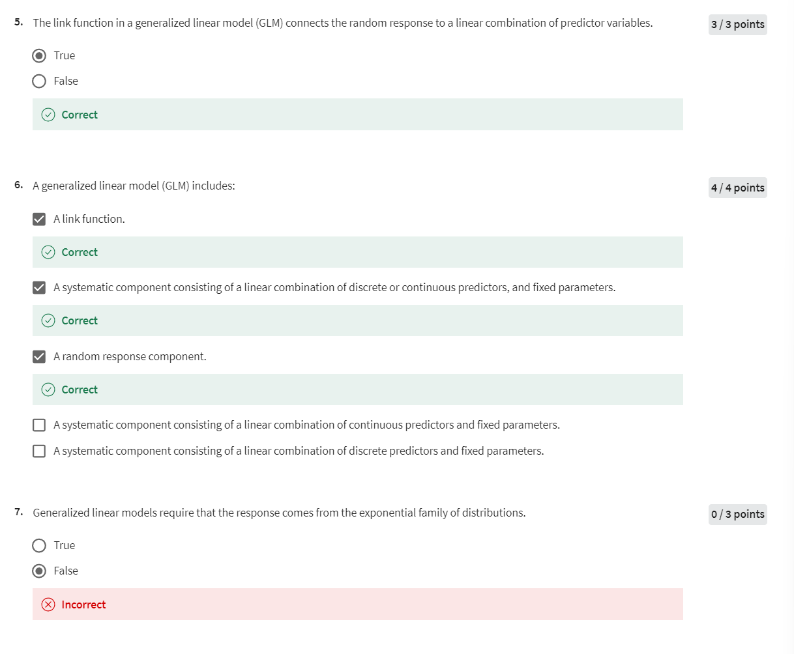

# Week 1 Quiz

## Quiz 1

### 作业整理与解释

1. **Question 1**:  
   **题目**: 在2003年非典（SARS）疫情期间，一些研究人员认为Ribavirin的治疗可能有助于预防因SARS导致的死亡。考虑以Ribavirin的剂量水平作为连续预测变量，以死亡（"Death"或"No Death"）作为响应的统计模型。这个模型违反了标准线性回归的假设。  
   **选择**: True  
   **解释**: 标准线性回归假设响应变量是连续的并且符合正态分布。而在这里，响应变量是二分类的（死亡或未死亡），这种情况下，使用线性回归模型是不合适的，因为它会违反线性回归的假设。对于这种二分类问题，更适合使用诸如逻辑回归的模型，它属于广义线性模型（GLM）的范畴。

2. **Question 2**:  
   **题目**: 广义线性模型（GLM）扩展了线性回归框架，使其可以处理非正态分布的响应变量，例如计数数据。  
   **选择**: True  
   **解释**: GLM确实扩展了线性回归的框架，使得模型能够处理响应变量不是正态分布的情况。GLM使用不同的链接函数和分布族来处理诸如二分类数据、计数数据等。

3. **Question 3**:  
   **题目**: 标准线性回归是一种广义线性模型（GLM）。  
   **选择**: True  
   **解释**: 标准线性回归可以被视为GLM的一个特殊情况，其中链接函数是恒等函数，响应变量服从正态分布。因此，标准线性回归是GLM的一个特例。

4. **Question 4**:  
   **题目**: 广义线性模型（GLM）的响应变量是随机成分。  
   **选择**: True  
   **解释**: 在GLM中，响应变量是随机成分的一部分。这意味着响应变量的分布被视为来自某个概率分布（例如二项分布、泊松分布等），这是随机部分，而系统部分则是预测变量的线性组合。

5. **Question 5**:  
   **题目**: 广义线性模型（GLM）中的链接函数将随机响应变量连接到预测变量的线性组合。  
   **选择**: True  
   **解释**: 链接函数的作用是将响应变量的期望值与预测变量的线性组合联系起来。这种方式允许我们将响应变量从非线性关联转化为线性形式，以便于处理和估计。

6. **Question 6**:  
   **题目**: 一个广义线性模型（GLM）包括：  
   **选择**: 
   - A link function. √
   - A systematic component consisting of a linear combination of discrete or continuous predictors, and fixed parameters. √
   - A random response component. √

   **解释**: 一个GLM包括以下三个主要部分：
   - **随机成分**：响应变量的概率分布（来自指数族分布）。
   - **系统成分**：预测变量的线性组合，可能包括离散或连续预测变量。
   - **链接函数**：用于将系统成分与随机成分连接起来。

7. **Question 7**:  
   **题目**: 广义线性模型（GLM）要求响应变量来自指数族分布。  
   **选择**: True  
   **解释**: GLM假定响应变量服从一个来自指数族的分布（如正态分布、二项分布、泊松分布等）。这类分布的一个特点是它们有一个自然的链接函数，可以将均值与线性预测变量关联起来。

通过以上的整理和解释，你应该对广义线性模型及其相关概念有了更清晰的理解。这些问题主要考察了GLM的基础知识，以及它如何扩展标准线性回归模型来处理更广泛类型的数据。