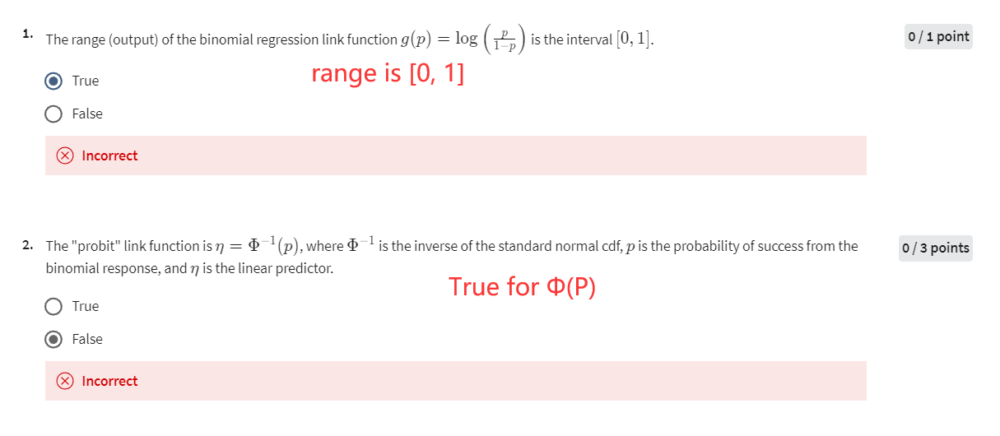
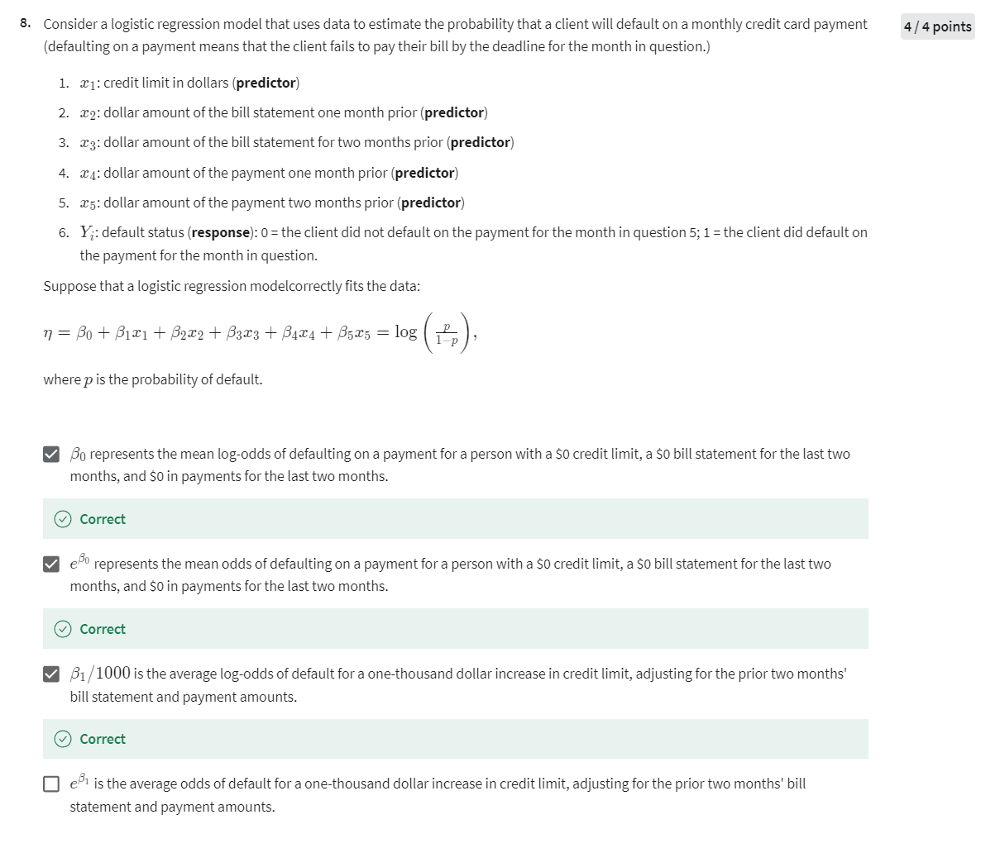
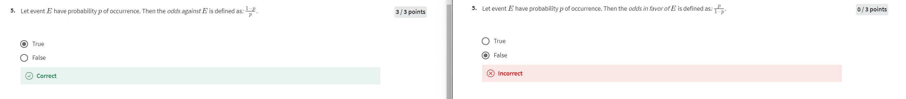

# Week 1 Quiz 2

## Quiz 2

### 详细解释

1. **Question 1**:  
   **题目**: 二项回归链接函数 \( g(p) = \log\left(\frac{p}{1-p}\right) \) 的输出范围是区间 \([0,1]\)。  
   **选项分析**:
   - **False**: 这是错误的。链接函数 \( g(p) = \log\left(\frac{p}{1-p}\right) \) 的输出实际上是整个实数集 \((-\infty, \infty)\)，而不是区间 \([0, 1]\)。区间 \([0, 1]\) 是该函数的输入范围，而不是输出范围。

   **题目**: 二项回归链接函数 \( g(p) = \log\left(\frac{p}{1-p}\right) \) 的输入范围是区间 \([0,1]\)。  
   **选项分析**:
   - **True**: 这是正确的。二项回归中的链接函数的输入 \(p\) 是一个概率，因此必须在区间 \([0, 1]\) 之间。

2. **Question 2**:  
   **题目**: "probit"链接函数是 \( \eta = \Phi^{-1}(p) \)，其中 \( \Phi^{-1} \) 是标准正态分布的逆累积分布函数，\( p \) 是二项响应的成功概率，\( \eta \) 是线性预测变量。  
   **选项分析**:
   - **True**: 这是正确的。Probit模型使用的是标准正态分布的逆累积分布函数作为链接函数，即 \( \eta = \Phi^{-1}(p) \)。
   - **False**: 但 \( \eta = \Phi(p) \) 是错误的，因为 \( \Phi(p) \) 是累积分布函数，而非其逆函数。逆函数 \( \Phi^{-1}(p) \) 才是probit模型中链接函数的正确形式。

3. **Question 3**:  
   **题目**: 二项回归的似然函数是响应的联合概率质量函数，但被解释为模型参数的函数（假定响应数据是固定的）。  
   **选项分析**:
   - **True**: 这是正确的。似然函数确实是基于观测数据的联合概率质量函数，但在参数估计时，它被视为模型参数的函数，数据被视为固定的。

4. **Question 4**:  
   **题目**: 似然函数和对数似然函数：  
   **选项分析**:
   - **both have the same maximum value. False**: 这是错误的。似然函数和对数似然函数的最大值不同。对数似然函数的最大值是似然函数最大值的对数。
   - **are both maximized at the same input/parameter value. Correct**: 这是正确的。尽管最大值不同，但它们在相同的参数值下达到最大值，因此可以使用对数似然来简化计算。

5. **Question 5**:  
   **题目**: 事件 \( E \) 发生的概率为 \( p \)，那么事件 \( E \) 的对数定义为：\( \frac{1-p}{p} \)。  
   **选项分析**:
   - **True**: 这是正确的。对数是指事件不发生的概率与发生概率的比率，即 \( \text{odds} = \frac{1-p}{p} \)。

6. **Question 6**:  
   **题目**: 假设感染某种病毒 \( v \) 的概率 \( p = 0.1 \)，感染该病毒的对数是多少？  
   **选项分析**:
   - **1/9 Correct**: 这是正确的。感染病毒的对数是 \( \frac{p}{1-p} = \frac{0.1}{1-0.1} = \frac{0.1}{0.9} = \frac{1}{9} \)。

7. **Question 7**:  
   **题目**: 考虑手术后乳腺癌患者的生存数据。数据包括响应（五年后的生存状态）和两个预测变量（患者手术时的年龄和检测到的癌性淋巴结数）。假设一个逻辑回归模型，标准化预测变量，正确拟合了数据：
   \[
   \eta = \beta_0 + \beta_1 z_1 + \beta_2 z_2 = \log\left(\frac{p}{1-p}\right),
   \]
   其中 \( p \) 是患者五年或更长时间生存的概率，\( z_j = \frac{x_j - \text{mean}(x_j)}{\text{sd}(x_j)} \)，\( j=1,2 \)。  
   **选项分析**:
   - **β0 代表平均年龄和检测到的平均癌性淋巴结数量的人的五年或更长时间生存的平均对数几率。Correct**: 这是正确的。标准化后的 \( \beta_0 \) 表示当所有预测变量都为平均值时的对数几率。
   - **For a fixed number of cancerous axillary nodes detected, a one standard deviation increase in age increases the log-odds of survival beyond 5 years by β1, on average. Correct**: 这是正确的。标准化后，年龄增加一个标准差导致生存超过五年的对数几率增加 \( \beta_1 \)。
   - **For a fixed number of cancerous axillary nodes detected, a one standard deviation increase in age increases the odds of survival beyond 5 years by a multiplicative factor of eβ1, on average. Correct**: 这是正确的。年龄每增加一个标准差，生存超过五年的几率将乘以 \( e^{\beta_1} \) 倍。

8. **Question 8**:  
   **题目**: 考虑一个逻辑回归模型，用数据来估计客户拖欠月度信用卡付款的概率（拖欠付款意味着客户在当月截止日期之前未能支付账单）。
   \[
   \eta = \beta_0 + \beta_1 x_1 + \beta_2 x_2 + \beta_3 x_3 + \beta_4 x_4 + \beta_5 x_5 = \log\left(\frac{p}{1-p}\right),
   \]
   其中 \( p \) 是拖欠的概率。  
   **选项分析**:
   - **β0 代表信用额度为0美元，过去两个月的账单为0美元，以及过去两个月的支付为0美元的人的拖欠付款的平均对数几率。Correct**: 这是正确的。\( \beta_0 \) 表示在所有预测变量都为零的情况下，拖欠付款的平均对数几率。
   - **eβ0 代表信用额度为0美元，过去两个月的账单为0美元，以及过去两个月的支付为0美元的人的拖欠付款的平均几率。Correct**: 这是正确的。\( e^{\beta_0} \) 表示在所有预测变量都为零的情况下，拖欠付款的平均几率。
   - **β1/1000 是调整过去两个月的账单和付款金额后的信用额度增加一千美元的平均对数几率。Correct**: 这是正确的。\( \beta_1/1000 \) 表示信用额度增加一千美元的情况下，调整其他变量后，拖欠付款的对数几率的增加值。
   - **eβ1 是调整过去两个月的账单和付款金额后的信用额度增加一千美元的平均几率。False**: 这是不正确的。\( e^{\beta_1} \) 表示信用额度增加一美元时，拖欠付款的平均几率。

### 1. **理解 \(\beta_1\) 的基本解释**

在逻辑回归模型中，\(\beta_1\) 表示自变量 \(x_1\)（在此例中是信用额度）增加 **1 美元** 时，响应变量的对数几率（log-odds）会发生的变化。因此，如果 \(x_1\) 增加了 1 美元，对数几率的变化量就是 \(\beta_1\)。

### 2. **按比例调整解释**

如果我们想理解 \(x_1\) 增加 1000 美元时的影响，那么：

- **原始参数 \(\beta_1\)** 是每 1 美元增加对数几率的变化量。
- 当 \(x_1\) 增加 1000 美元时，理论上应该是 \(\beta_1 \times 1000\) 表示的对数几率的变化。

但是，当我们引入 \(\beta_1/1000\) 时，这个参数的解释发生了变化。

### 3. **引入 \(\beta_1/1000\) 的解释**

当我们将 \(\beta_1\) 除以 1000 时，\(\beta_1/1000\) 代表的是**每增加 1000 美元**时的对数几率变化量，而不是每 1 美元的变化量。

因此：

- \(\beta_1\) 是每增加 1 美元的变化量；
- \(\beta_1/1000\) 是每增加 1000 美元的变化量。

### 4. **回答您的问题**

您提到的 "变化是 1/1000 倍" 和 "1000 美元是 1000 倍" 是指不同的尺度。

- **\(\beta_1/1000 \times 1\)** 确实意味着我们对 1 美元的影响进行了缩小，表示每 1 美元的影响是 \(\beta_1\) 的 1/1000。
- 但如果直接使用 \(\beta_1/1000\)，那就表示每 1000 美元的影响，是原本的 1/1000 倍再乘以 1000（这就回到了 \(\beta_1\) 的尺度）。

所以，当我们使用 \(\beta_1/1000\) 时，\(\beta_1/1000\) 本身就被设计为表示**每增加 1000 美元**时的变化量，这个参数直接表达了信用额度每增加 1000 美元的对数几率变化，而不是在计算中再去放大 1000 倍。

### 5. **总结**

- **\(\beta_1\)** 表示每 1 美元的影响。
- **\(\beta_1/1000\)** 表示每 1000 美元的影响。

这种除以 1000 的处理方式简化了对大额变化的解释，而不是在解释中再去放大 1000 倍。通过这种方式，\(\beta_1/1000\) 直接提供了与 1000 美元变化相关的解释，而无需额外的比例计算。

这些分析帮助你更深入理解了逻辑回归模型中每个参数的意义及其在不同场景下的应用。
