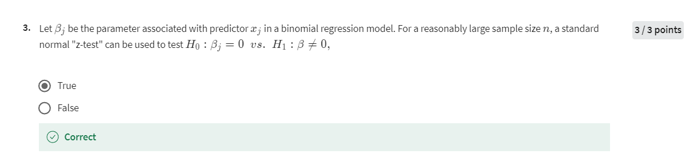

# Week1 Quiz3

## Quiz 3

<!--  -->

## Detailed Explanation

### 题目 1

The maximum likelihood estimator is asymptotically unbiased.

#### 解释

**英文**: The maximum likelihood estimator (MLE) is a method used to estimate the parameters of a statistical model. The statement here is true because as the sample size increases to infinity, the bias of the MLE approaches zero, making it asymptotically unbiased.

**中文**: 最大似然估计（MLE）是一种用于估计统计模型参数的方法。此题为真，因为随着样本量趋近于无穷大，MLE的偏差趋近于零，这意味着它是渐进无偏的。

### 题目 2

As the sample size \( n \) tends to infinity, the distribution of the maximum likelihood estimator becomes \( \hat{\theta}_{ML} \sim N(\theta, I^{-1}(\theta)) \).

#### 解释

**英文**: As the sample size increases, the distribution of the MLE approaches a normal distribution centered at the true parameter value \( \theta \), with variance equal to the inverse of the Fisher information. This is a consequence of the Central Limit Theorem applied to MLEs.

**中文**: 随着样本量增加，MLE的分布趋向于以真实参数值 \( \theta \) 为中心的正态分布，其方差等于Fisher信息的逆。这是将中心极限定理应用于MLE的结果。

### 题目 3

Let \( \beta_j \) be the parameter associated with predictor \( x_j \) in a binomial regression model. For a reasonably large sample size \( n \), a standard normal "z-test" can be used to test \( H_0: \beta_j = 0 \) vs. \( H_1: \beta_j \neq 0 \).

#### 解释

**英文**: In a binomial regression model, when the sample size is sufficiently large, the estimated coefficients \( \beta_j \) follow an approximately normal distribution due to the Central Limit Theorem. Therefore, a standard normal "z-test" can be used to test the null hypothesis \( H_0: \beta_j = 0 \) against the alternative hypothesis \( H_1: \beta_j \neq 0 \). This test determines whether the predictor \( x_j \) has a statistically significant effect on the response variable.

**中文**: 在二项回归模型中，当样本量足够大时，由于中心极限定理，估计的系数 \( \beta_j \) 近似服从正态分布。因此，可以使用标准正态 "z 检验" 来检验原假设 \( H_0: \beta_j = 0 \) 与备择假设 \( H_1: \beta_j \neq 0 \)。此检验用于判断预测变量 \( x_j \) 是否对响应变量有统计显著性的影响。

### 题目 3.5

Let \( \beta_j \) be the parameter associated with predictor \( x_j \) in a binomial regression model. For a reasonably large sample size \( n \), a standard normal "z-test" can be used to test whether \( x_j \) should be in the model.

#### 解释

**英文**: This question extends the idea of using the z-test to determine whether a predictor \( x_j \) should be included in the model. If the z-test indicates that \( \beta_j \) is significantly different from zero, it suggests that \( x_j \) is important and should be part of the model.

**中文**: 该问题扩展了使用z检验来决定预测变量 \( x_j \) 是否应该包含在模型中的想法。如果z检验表明 \( \beta_j \) 显著不同于零，则表明 \( x_j \) 具有重要性，应该包含在模型中。

### 题目 4

Let \( X_1, \ldots, X_n \) be a random sample from a distribution with pdf \( f(x; \theta) \), and let \( \hat{\theta} \) be the maximum likelihood estimator of \( \theta \). Then

\[ \left( \hat{\theta}_{ML} - \frac{1.96}{\sqrt{nI(\theta)}}, \hat{\theta}_{ML} + \frac{1.96}{\sqrt{nI(\theta)}} \right) \]

is an approximate 95% confidence interval for \( \theta \).

#### 解释

**英文**: This statement is true and reflects a method for constructing a 95% confidence interval for a parameter \( \theta \) using the MLE \( \hat{\theta}_{ML} \) and the Fisher information \( I(\theta) \). The interval gives an estimate of where the true parameter is likely to be with 95% confidence.

**中文**: 这个说法是正确的，它反映了使用MLE \( \hat{\theta}_{ML} \) 和Fisher信息 \( I(\theta) \) 构建参数 \( \theta \) 的95%置信区间的方法。该区间提供了一个估计，说明在95%的置信水平下，真实参数可能所在的范围。

qnorm(0.975) = 1.96

### 题目 5

Goodness of fit metrics - such as the residual deviance - are not useful for the binomial regression with a Bernoulli (0/1) response.

#### 解释

**英文**: This statement is true. In binomial regression models with a Bernoulli response, traditional goodness-of-fit metrics like residual deviance may not be informative due to the binary nature of the response variable. These metrics are more useful in models with a larger number of trials per observation.

**中文**: 这个说法是正确的。在二项回归模型中，响应变量为Bernoulli (0/1)时，传统的拟合优度度量（如残差偏差）可能不具备信息性，因为响应变量是二元的。这些度量在每次观察有更多试验次数的模型中更有用。

### 题目 5.5

Goodness of fit metrics - such as the residual deviance - are only useful for the binomial regression with a relatively large number of trials (e.g. \( n > 5 \)).

#### 解释

**英文**: This statement elaborates on the previous one, highlighting that goodness-of-fit metrics like residual deviance are meaningful only when there are a sufficient number of trials in a binomial regression. For small numbers of trials (like in a Bernoulli response), these metrics lose their interpretative power.

**中文**: 这个说法补充了前一个问题，强调拟合优度度量（如残差偏差）只有在二项回归中试验次数足够多时才有意义。对于试验次数较少的情况（如Bernoulli响应），这些度量失去了解释力。

### 题目 6

Consider a logistic regression fit with an independent response \( Y_i \sim \text{Binomial}(1, p) \) and a single predictor variable \( x \). The linear predictor is:

\[ \eta_i = \beta_0 + \beta_1 x_i \]

Test \( H_0: \beta_1 = 0 \) vs \( H_1: \beta_1 \neq 0 \) by computing the appropriate p-value, rounded to the hundredths place.

Coefficients:

| Coefficient   | Estimate | Std. Error |
|---------------|----------|------------|
| (Intercept)   | -1.2467  | 0.6347     |
| x             | 1.4224   | 1.1541     |

\[ p\text{-value} = 0.22 \]

#### 解释

**英文**: To test the null hypothesis that the coefficient \( \beta_1 \) is zero, we compute the z-statistic by dividing the estimated coefficient by its standard error, then find the p-value using the standard normal distribution. In this case, the p-value is 0.22, which suggests that \( \beta_1 \) is not statistically significant at common significance levels (e.g., 0.05).

**中文**: 为了检验系数 \( \beta_1 \) 为零的原假设，我们通过将估计系数除以其标准误差来计算z统计量，然后使用标准正态分布找到p值。在本例中，p值为0.22，这表明 \( \beta_1 \) 在常见的显著性水平（如0.05）下没有统计显著性。

### 题目 7

Consider a logistic regression fit with an independent response \( Y_i \sim \text{Binomial}(1, p) \) and a single predictor variable \( x \). The linear predictor is:

\[ \eta_i = \beta_0 + \beta_1 x_i \]

Use maximum likelihood theory to construct an approximate 95% confidence interval for \( \beta_0 \). Round all values to the hundredths place.

Coefficients:

| Coefficient   | Estimate | Std. Error |
|---------------|----------|------------|
| (Intercept)   | -1.2467  | 0.6347     |
| x             | 1.4224   | 1.1541     |

\[ \text{Confidence interval} = (-2.48, -0.02) \]

#### 解释

**英文**: To construct a 95% confidence interval for \( \beta_0 \), we use the estimate of \( \beta_0 \) and its standard error. The interval is computed as the estimate plus and minus 1.96 times the standard error. Here, the resulting interval is (-2.48, -0.02), indicating where the true value of \( \beta_0 \) is likely to lie with 95% confidence.

**中文**: 为了构建 \( \beta_0 \) 的95%置信区

间，我们使用 \( \beta_0 \) 的估计值及其标准误差。区间通过估计值加减1.96倍的标准误差计算得出。在此例中，得到的区间为 (-2.48, -0.02)，这表明在95%的置信水平下， \( \beta_0 \) 的真实值可能位于该区间内。
