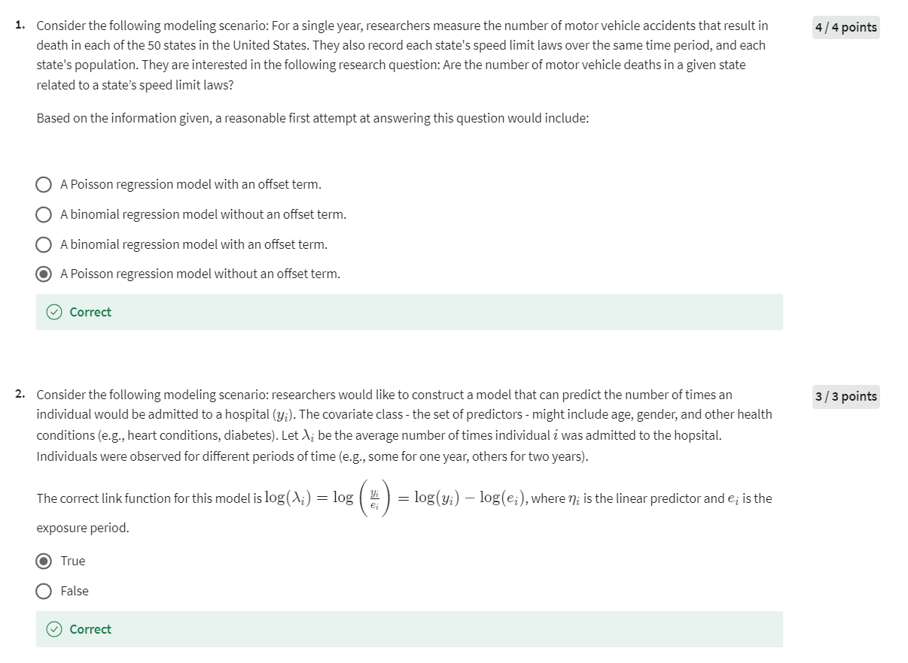
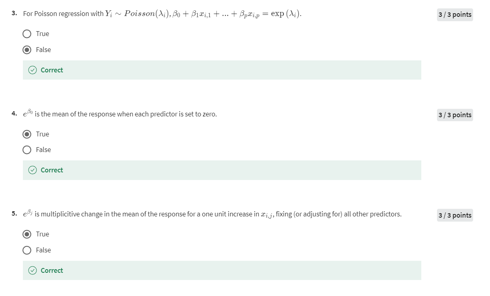
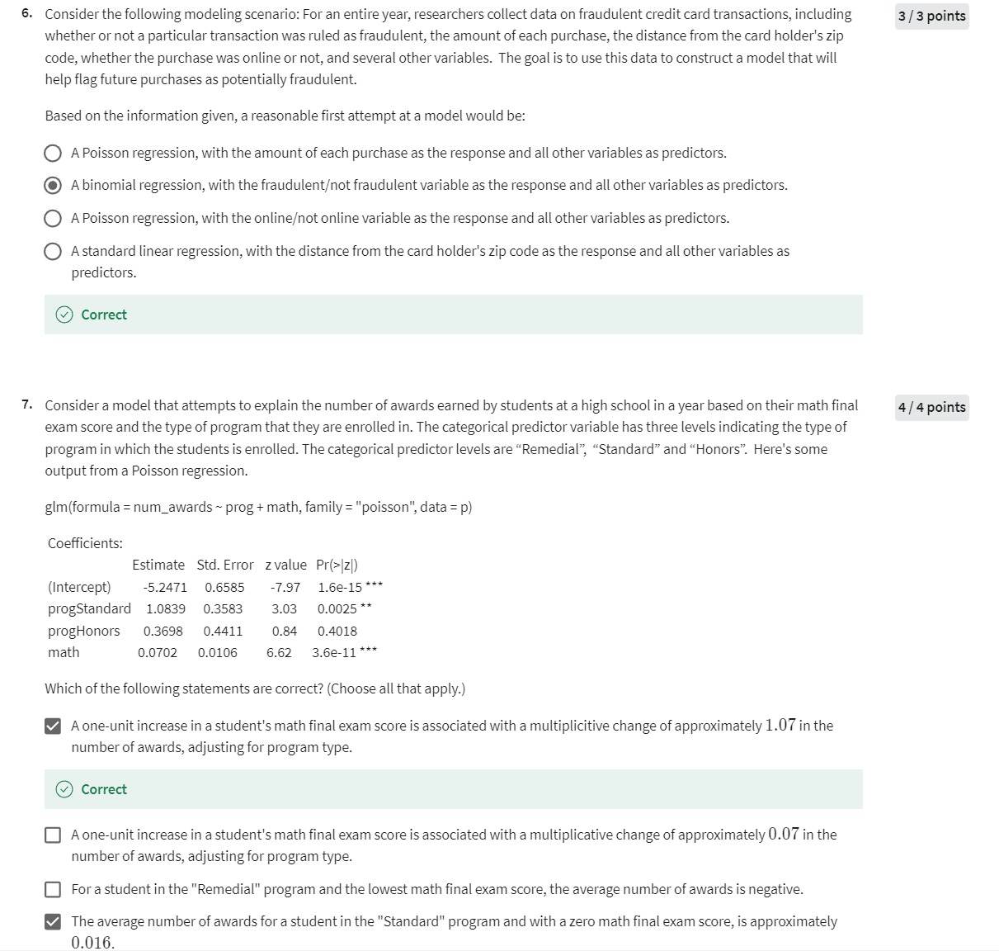
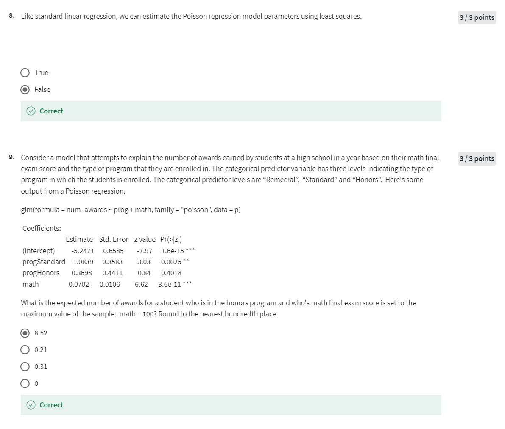

# Week2

## Quiz 1






让我们一一解答这些问题，并提供详细的解释。

### Question 1

**解释：**

在这个场景中，研究者们感兴趣的是一个州的车辆死亡人数是否与该州的限速法规相关。由于他们测量的是每个州发生的致命车祸次数，这是一个**计数**变量，因此Poisson回归是适用的。这里的**偏置项（offset term）**用于调整每个州的不同人口规模。这使得Poisson回归模型能够解释人口规模对死亡人数的影响。

**正确答案：** A Poisson regression model with an offset term.

在回归分析中，**offset term**（偏置项）是一种特殊的自变量，它的系数被固定为1，不进行估计。也就是说，偏置项对模型的贡献是已知且固定的，而不是像其他自变量一样通过数据来估计其系数。

#### Offset Term 的使用场景

偏置项通常用于以下场景：

1. **调整不同的曝光时间（Exposure Time）或人群规模**：
   - 例如，在Poisson回归模型中，如果我们要建模某种事件发生的次数（例如，疾病发生的次数、交通事故的次数），并且不同个体或组别的观察时间（或人口规模）不同，那么我们可以使用偏置项来调整这些差异。
   - 在这种情况下，偏置项通常是观察时间的对数值（或人口规模的对数值），并确保其系数为1，从而仅调整事件发生次数的期望值，而不改变其他变量的效应。

2. **处理比率或率数据**：
   - 当模型中响应变量表示的是一个比率（如某段时间内的事件发生率），偏置项可以用于标准化这些比率。例如，在建模每个人的事件发生率时，可以使用观察时间作为偏置项。

#### Offset Term 在Poisson回归中的应用

在Poisson回归中，偏置项常被用于调整基于不同时间段的事件计数。比如说，如果我们建模的是不同时间段内某事件发生的次数，我们可以通过对这些时间段取对数，然后将其作为偏置项纳入模型中。

#### 例子

假设你有一个数据集，包含每个城市的一年内交通事故的数量（`num_accidents`）和该城市的人口（`population`）。如果你想要研究人口对交通事故数量的影响，可以使用 `log(population)` 作为偏置项，因为你希望模型能够调整每个城市的人口规模。

```r
model <- glm(num_accidents ~ speed_limit, offset = log(population), family = poisson, data = data)
```

在这个模型中：

- `num_accidents` 是响应变量。
- `speed_limit` 是解释变量（自变量）。
- `log(population)` 是偏置项，用于调整不同城市的不同人口规模。

**解释：**

- 偏置项的系数固定为1，模型通过调整 `population` 的对数值，来解释不同城市人口规模的影响，从而更准确地估计速度限制对事故数量的影响。

#### 总结

偏置项在回归分析中提供了一种调整不需要估计的已知效应的方法，特别适用于处理不同曝光时间、人口规模等情况。这种调整有助于更好地理解和解释其他变量的影响。

在这个问题中，研究人员想要研究每个州的车辆死亡数量是否与该州的限速法规相关。问题描述中提到了两个关键变量：

1. **响应变量**：每个州的车辆死亡数量（计数数据）。
2. **自变量**：每个州的限速法规。

#### 为什么选择Poisson回归？

Poisson回归模型适用于建模**计数数据**，例如这里的车辆死亡数量。这种模型假设响应变量（车辆死亡数量）服从Poisson分布，并且与自变量（限速法规）相关联。

#### 为什么没有使用Offset Term？

Offset term通常用于以下两种情况：

1. **标准化处理**：如调整不同观察时间或人口规模。例如，如果我们想要比较不同州的死亡率，而不是绝对的死亡数量，可能会使用人口作为偏置项进行标准化。
2. **率的建模**：如事件发生的频率（事件数/时间或事件数/人口）。

在这个问题中，虽然描述中提到人口，但研究的主要兴趣在于绝对的死亡数量，而不是标准化的死亡率。因此，如果我们只关心每个州的总死亡人数和限速法规之间的关系，而不考虑每个州的人口差异，则可以在没有偏置项的情况下使用Poisson回归。

#### 为什么这个选择合理？

如果研究的目标是直接探讨限速法规对车辆死亡总数的影响，而不考虑州人口的标准化（即不计算每1000人中的死亡率等），那么一个不含偏置项的Poisson回归模型是一个合理的选择。这种模型能够直接估计限速法规对总死亡数的影响，而不调整人口规模对结果的影响。

因此，在这种情况下，选择 **“A Poisson regression model without an offset term”** 是合理的，因为它直接探讨了限速法规对车辆死亡数量的影响，而没有调整为标准化死亡率。

### Question 2

**解释：**

在这个问题中，研究者们希望预测个体入院次数。因为每个人观察的时间不同（例如，一些人观察了一年，另一些人观察了两年），所以我们使用一个**偏置项**来调整每个人的观察期（即曝光时间）。模型的对数连接函数是合适的选择。

**正确答案：** True

### Question 3

**解释：**

在Poisson回归模型中，线性预测器和Poisson分布参数（即均值 \( \lambda_i \)）之间的关系通过对数链接函数连接。正确的形式是：

\[
\log(\lambda_i) = \beta_0 + \beta_1 x_{i,1} + \dots + \beta_p x_{i,p}
\]

**错误答案：** 公式给错了，正确形式是 \(\log(\lambda_i)\)。

**正确答案：** False

### Question 4

**解释：**

在Poisson回归中，\( e^{\beta_0} \) 表示在所有其他预测变量为零时，响应变量的期望值。这意味着它表示了基线条件下的均值。

**正确答案：** True

### Question 5

**解释：**

在Poisson回归中，\( e^{\beta_j} \) 表示在保持其他变量不变的情况下，自变量 \( x_{i,j} \) 增加一个单位时，响应变量期望值的乘数变化。

**正确答案：** True

### Question 6

**解释：**

这个问题中的响应变量是“是否为欺诈交易”，这是一个二分类变量，因此应该使用**二项回归**（logistic回归）模型，而不是Poisson回归。Poisson回归适用于计数数据，而二项回归适用于二分类数据。

**正确答案：** A binomial regression, with the fraudulent/not fraudulent variable as the response and all other variables as predictors.

让我们仔细分析第6题中其余选项为什么是错误的。

**场景描述：**
研究人员收集了整整一年的信用卡欺诈交易数据，包括某次交易是否被判定为欺诈，购买金额，距离持卡人邮政编码的距离，购买是否在线等变量。研究的目标是使用这些数据来构建一个模型，以帮助标记未来的潜在欺诈交易。

**正确答案：**

- **A binomial regression, with the fraudulent/not fraudulent variable as the response and all other variables as predictors.**

**其他选项分析：**

1. **A Poisson regression, with the amount of each purchase as the response and all other variables as predictors.**

   - **错误原因：**
     - Poisson回归适用于建模计数数据（即非负整数，如事件发生的次数），而不是连续变量如购买金额。购买金额是一个连续变量，不是计数变量。因此，使用Poisson回归来预测购买金额是不合适的。

2. **A Poisson regression, with the online/not online variable as the response and all other variables as predictors.**

   - **错误原因：**
     - Poisson回归不适用于建模二分类变量（如“是否在线”），它适合处理的是计数数据。因此，用Poisson回归来预测二分类变量“是否在线”是错误的。相反，二分类数据应使用logistic回归（即二项回归）模型来建模。

3. **A standard linear regression, with the distance from the card holder's zip code as the response and all other variables as predictors.**

   - **错误原因：**
     - 标准线性回归适用于建模连续响应变量，而在此场景中，重点是预测交易是否为欺诈（这是一个二分类变量）。距离持卡人邮政编码的距离是一个可能的预测变量，而不是响应变量。因此，用标准线性回归来预测“距离”作为响应变量是错误的，因为这与问题的核心不符。

- Poisson回归不适用于连续变量或二分类变量，正确的使用场景是处理计数数据。
- 二项回归（logistic回归）适用于二分类响应变量（如是否为欺诈）。
- 标准线性回归适用于连续响应变量，但在这个问题中，响应变量是二分类变量（是否为欺诈），因此不适用。

综上所述，唯一正确的选项是：**A binomial regression, with the fraudulent/not fraudulent variable as the response and all other variables as predictors.**

### Question 7

**解释：**

- **选项 1**: 数学成绩每增加1分，奖项数量的期望值乘以约1.07倍，这正确地解释了 \( e^{\beta} \) 的含义。
- **选项 2**: 这个选项错误，因为 0.07 是线性预测器的系数，而不是期望值的乘数变化。
- **选项 3**: 错误，平均奖项数量不能为负，因为Poisson模型中的响应变量为计数。
- **选项 4**: 计算为 \( \exp(-5.2471 + 1.0839) \approx 0.016 \)，正确。

**正确答案：** 选项1和4正确。

### Question 8

**解释：**

Poisson回归模型参数的估计是基于最大似然估计（MLE），而不是最小二乘法。最小二乘法通常用于线性回归，而不是Poisson回归。

**正确答案：** False。正确的回答是Poisson回归使用的是最大似然估计（MLE）。

### Question 9

**解释：**

根据给定的系数，我们可以计算一个在荣誉项目中、数学成绩为100的学生的期望奖项数量：

\[
\log(\text{num\_awards}) = -5.2471 + 0.3698 + 100 \times 0.0702 = 2.1449
\]

然后取指数：

\[
\text{num\_awards} = \exp(2.1449) \approx 8.52
\]

**正确答案：** 8.52
