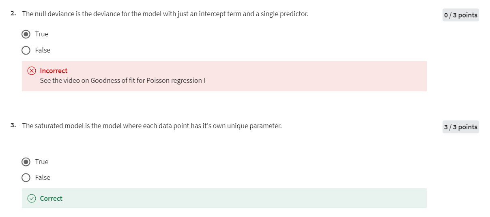
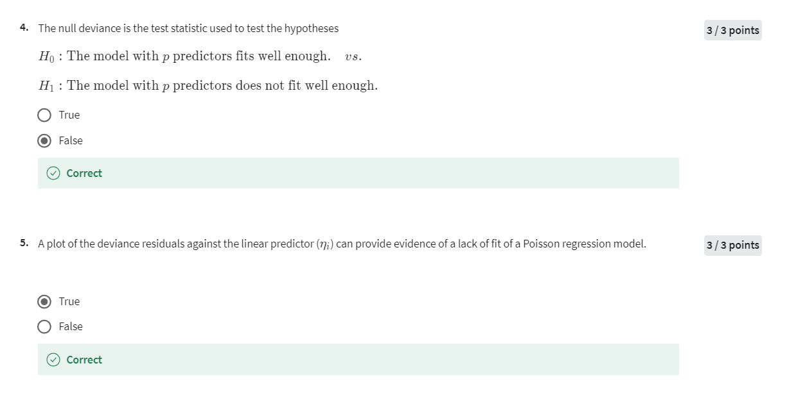

# Week 2

## Week 2 Quiz 2






### Question 1

- **True**: "Deviance" 在Poisson回归中定义为-2倍的对数似然函数值（log likelihood），并在最大似然估计（MLE）处进行计算。这是用于衡量模型拟合优度的重要指标。

### Question 2.1

- **True**: "Null deviance" 是指仅包含截距项的模型的偏差。这种模型假设所有观测值的预期值相同，并用于衡量包括预测变量后的模型是否显著改进。

### Question 2.2

- **False**: "Null deviance" 只考虑截距项，而不是包含截距和单个预测变量的模型。因此，包含单个预测变量的模型偏差不能称为null deviance。

### Question 3

- **True**: 饱和模型（Saturated Model）是指每个数据点都具有独立参数的模型，完全拟合了数据，结果是偏差为零。

### Question 3.2

- **False**: 饱和模型是每个数据点都有一个独特参数的模型，而不仅仅是包含所有预测变量的模型。包含所有预测变量的模型可能仍然有未解释的偏差，不是饱和模型。

### Question 4

- **False**: "Null deviance" 不是用于检验包含 \( p \) 个预测变量的模型是否拟合得足够好，而是用来评估包含截距项的简单模型与更复杂模型之间的拟合差异。相反，这个测试通常涉及“残差偏差（Residual deviance）”来比较模型的拟合优度。

### Question 4.2

- **True**: 残差偏差用于测试包含 \( p \) 个预测变量的模型是否拟合得足够好。通过比较带有和不带有额外预测变量的模型的残差偏差，可以评估额外预测变量的统计显著性。

**Null偏差（Null Deviance）** 是在回归模型中用于评估基础模型（通常是仅包含截距项的模型）的拟合优度。它衡量的是当前数据相对于这个最简单模型的偏差，即数据中没有解释变量（自变量）时，模型的拟合情况。

#### Null偏差用来检验什么？

Null偏差主要用于与包含预测变量的更复杂模型的偏差（Residual Deviance）进行比较，以确定引入的自变量是否显著改善了模型的拟合。具体来说，Null偏差与残差偏差的比较可以用来检验以下假设：

- **零假设 \( H_0 \)**：仅包含截距项的简单模型拟合得足够好。
- **备择假设 \( H_1 \)**：包含一个或多个预测变量的模型拟合得更好。

通过比较这两个偏差的差异，可以评估预测变量的整体显著性。如果残差偏差显著小于Null偏差，则表明添加的预测变量确实改善了模型的拟合。

#### Null偏差的例子

假设我们有一个数据集，其中包含50个州每年的交通事故死亡人数（`num_accidents`），以及每个州的限速法规（`speed_limit`）和人口（`population`）。我们感兴趣的是评估限速法规是否与交通事故死亡人数相关。

#### R中的示例

1. **仅包含截距项的模型**：

```r
# 加载数据
data <- data.frame(
  num_accidents = c(5, 10, 20, 30, 25, 15, 35), # 示例数据
  speed_limit = c(55, 60, 65, 70, 55, 60, 65),
  population = c(10000, 20000, 15000, 25000, 18000, 22000, 16000)
)

# 拟合仅包含截距项的模型（Null模型）
null_model <- glm(num_accidents ~ 1, family = poisson, data = data)

# 查看Null偏差
null_deviance <- null_model$deviance
print(null_deviance)
```

2. **包含预测变量的模型**：

```r
# 拟合包含预测变量的模型
full_model <- glm(num_accidents ~ speed_limit + population, family = poisson, data = data)

# 查看残差偏差
residual_deviance <- full_model$deviance
print(residual_deviance)

# 比较Null偏差和残差偏差
print(null_deviance - residual_deviance)
```

#### 解释

- **Null偏差**：仅包含截距项的模型的偏差，这代表了没有预测变量时模型的拟合情况。
- **残差偏差**：包含所有预测变量的模型的偏差，反映了复杂模型的拟合情况。

**如果Null偏差显著大于残差偏差**，这意味着引入的预测变量（如`speed_limit`和`population`）显著改善了模型的拟合。

#### 结论

Null偏差用于评估最简单模型（仅截距项）的拟合情况，并通过与残差偏差的比较，来检验引入的预测变量是否显著提高了模型的拟合优度。这种比较常用于模型选择和评估中，以判断哪些变量对解释响应变量是重要的。

### Question 5

- **True**: 在Poisson回归中，绘制偏差残差（deviance residuals）与线性预测器 \( \eta_i \) 的关系图可以揭示模型的拟合不足。如果有系统性的模式或趋势，可能表明模型不适合数据。

好的，我来详细解释一下偏差残差（Deviance Residuals）与线性预测器（\(\eta_i\)）之间关系图的作用和含义。

#### 什么是偏差残差（Deviance Residuals）？

偏差残差是一种用于评估回归模型拟合优度的残差类型。它是由模型的实际值与预测值之间的差异计算出来的，经过处理后，用于衡量每个观测值对总体偏差的贡献。在Poisson回归中，偏差残差的定义是：

\[
r_i = \text{sign}(y_i - \hat{\mu}_i) \sqrt{2 \left[ y_i \log\left(\frac{y_i}{\hat{\mu}_i}\right) - (y_i - \hat{\mu}_i) \right]}
\]

其中：

- \(y_i\) 是实际观测值。
- \(\hat{\mu}_i\) 是通过模型预测的期望值。

偏差残差是一个衡量单个数据点如何影响模型拟合的指标。如果偏差残差很大，意味着该数据点与模型的预测值之间存在较大的差异，可能表明模型对这些数据点的拟合不够好。

#### 什么是线性预测器（\(\eta_i\)）？

线性预测器（\(\eta_i\)）是回归模型中自变量的线性组合。对于Poisson回归，它通常是自变量通过模型系数的线性组合再加上截距项：

\[
\eta_i = \beta_0 + \beta_1 X_{i1} + \beta_2 X_{i2} + \dots + \beta_p X_{ip}
\]

在Poisson回归中，线性预测器与响应变量的期望值之间通过对数链接函数连接，即：

\[
\log(\hat{\mu}_i) = \eta_i
\]

### 为什么要绘制偏差残差与线性预测器的关系图？

绘制偏差残差与线性预测器（\(\eta_i\)）之间的关系图是诊断回归模型的一种常见方法。通过这个图，可以评估模型是否存在系统性的拟合不足。具体来说：

- **随机分布**：如果模型拟合良好，偏差残差相对于线性预测器的图应该是随机分布的，没有明显的模式或趋势。这表明模型的预测误差在整个数据集上是均匀分布的，模型是合适的。
  
- **模式或趋势**：如果图中出现了系统性的模式或趋势，例如残差随着\(\eta_i\)的变化而系统性增大或减小，或者呈现出某种非随机的结构，这可能表明模型存在拟合不足或其他问题（例如缺失变量、非线性效应未捕捉到等）。

#### 举例说明

假设你在Poisson回归中使用的是车辆事故数据，你绘制了偏差残差与线性预测器的关系图。如果图中显示偏差残差没有明显的模式，残差围绕零上下随机分布，这说明你的模型对数据的拟合是合理的。

然而，如果图中显示残差随线性预测器增加而增大，可能表明你的模型没有充分捕捉数据中的某些模式，可能需要引入更多的变量或者考虑模型中的非线性效应。

#### 总结

偏差残差与线性预测器的关系图是诊断Poisson回归模型拟合优度的有力工具。通过观察残差是否存在系统性的模式，可以判断模型是否适合数据，是否需要进一步调整或改进。如果图中显示残差呈现随机分布，则说明模型拟合良好；如果存在模式或趋势，则可能需要对模型进行进一步的调整。

### Question 6

**分析：**

**测试假设：**

- **正确的假设：**
  - \( H_0 \)：包含 `math` 和 `prog` 的模型拟合得足够好。
  - \( H_1 \)：仅包含 `math` 的模型拟合得足够好。

**结论：**

- **程序变量的重要性：** 通过对比两个模型的残差偏差，可以判断`prog`变量是否显著。显著性检验的p值（Pr(>Chi)）为0.00069，表明添加 `prog` 变量显著提高了模型的拟合。因此，程序变量在模型中具有统计显著性。

**其他不正确选项：**

- **错误的假设：** 如果假设中提到的 \( H_0 \) 只考虑 `math` 而不是两个变量，这将不准确。
- **错误的结论：** 认为程序变量没有统计显著性是不正确的，因为p值表明 `prog` 变量显著。

**χ²检验：**

- **χ²检验：** 是用于比较嵌套模型（如上述两个模型）的标准方法，通过比较残差偏差的差异来确定额外变量是否显著。

第六题中的表格展示了两个Poisson回归模型的拟合结果，其中一个模型只包含数学成绩作为预测变量，另一个模型则同时包含数学成绩和学生参加的项目类型（“Remedial”、“Standard”和“Honors”）。让我们一步步解读表格中的信息。

#### 表格内容

| Model | Resid. Df | Resid. Dev | Df | Deviance | Pr(>Chi) |
|-------|-----------|------------|----|----------|----------|
| Model 1: `num_awards ~ math` | 198 | 204 | — | — | — |
| Model 2: `num_awards ~ prog + math` | 196 | 189 | 2 | 14.6 | 0.00069 ** |

#### 表格各列解释

1. **Model**：表示模型的名称或公式。在这个表格中，有两个模型：
   - **Model 1**：`num_awards ~ math`，即只用数学成绩（`math`）来预测学生获得奖项的数量。
   - **Model 2**：`num_awards ~ prog + math`，即使用数学成绩和项目类型（`prog`）一起预测学生获得奖项的数量。

2. **Resid. Df**（残差自由度）：残差自由度指的是数据点的数量减去模型中估计的参数数量。自由度的减少反映了模型的复杂性。对于 Model 1，自由度为198，因为只包含一个预测变量（数学成绩）和一个截距项；而 Model 2 中，自由度为196，因为增加了两个额外的参数（项目类型的两个水平）。

3. **Resid. Dev**（残差偏差）：这是模型的残差偏差，是衡量模型拟合优度的指标。残差偏差越小，表示模型拟合数据的效果越好。在这个表格中，Model 1 的残差偏差为 204，Model 2 的残差偏差为 189。残差偏差的减少表明，Model 2 比 Model 1 能更好地拟合数据。

4. **Df**（自由度变化）：这是两个模型之间的自由度差异。在这个例子中，自由度变化为2，因为 Model 2 比 Model 1 多了两个参数（项目类型的两个水平）。

5. **Deviance**（偏差变化）：这是两个模型之间的偏差差异。偏差变化量为14.6，表示引入项目类型变量后，模型的拟合优度显著改善了。

6. **Pr(>Chi)**（卡方检验的p值）：这是用于检验偏差变化显著性的p值。这里的p值为0.00069，表明在0.05的显著性水平下，项目类型（`prog`）对模型拟合的改善是非常显著的。

#### 结论

1. **显著性检验的结论**：
   - 表格中的p值（Pr(>Chi) = 0.00069）非常小，远小于常用的显著性水平（如0.05）。这意味着我们有足够的证据拒绝零假设，说明引入项目类型（`prog`）变量显著提高了模型的拟合度。

2. **项目类型变量的重要性**：
   - 通过模型2的偏差明显小于模型1的偏差，我们可以得出结论：项目类型（`prog`）在预测学生获得的奖项数量方面是一个重要的变量。

3. **模型的优劣比较**：
   - Model 2（包含项目类型和数学成绩）比Model 1（只包含数学成绩）有更好的拟合效果。因此，在分析学生获得奖项的数量时，考虑项目类型是有意义的。

### Question 7

- **True**: 由于骑自行车人数的行为在连续天数之间可能存在依赖性，因此一天的骑行可能影响到下一天的骑行。这种依赖性会导致数据中的**过度分散（overdispersion）**，即方差大于Poisson模型假定的均值。

例子中，我们讨论的是每天骑行的人数。假设某人今天骑行过曼哈顿大桥，那么他明天再次骑行的概率可能会增加。这种行为上的依赖性（即事件在不同天之间的关联）破坏了Poisson模型中的独立性假设。

依赖性增加了数据的方差：如果今天骑行的人更有可能明天也骑行，那么实际观测到的方差就会增加，因为一些数据点之间不是独立的。这意味着不同天数的骑行人数不是相互独立的，这样会使得一些天数的骑行人数特别高，而另一些天数可能特别低，从而增加了方差。

聚集效应：当事件（例如骑行）在某些天数中聚集时，这种现象会导致比Poisson分布假设的方差更大的方差。这种聚集或聚簇效应往往会使得Poisson回归模型低估了数据中的变异性，从而导致过度分散。

### Question 8

**分析：**

- **正确的原因：**
  - **缺失的预测变量：** 如果有重要的预测变量没有包含在模型中，模型可能无法完全解释响应变量的变化，从而导致过度分散。
  - **依赖响应变量：** 如果响应变量之间存在相关性（如时间依赖性），Poisson模型假定的独立性可能不成立，从而导致过度分散。
  - **异常值：** 数据中的异常值可能会导致估计的方差增大，从而引起过度分散。
  - **有很多零记录的响应变量：** 响应变量中有过多的零会导致方差超过Poisson模型的假定值，从而导致过度分散。

- **错误的原因：**
  - **非正态预测变量：** Poisson回归模型对响应变量的分布假设是Poisson分布，而不是预测变量的分布。预测变量的非正态性不会直接导致过度分散。

**正确选项：**

- 缺失的预测变量、依赖响应变量、异常值、以及响应变量中有很多零记录都是过度分散的潜在原因。
