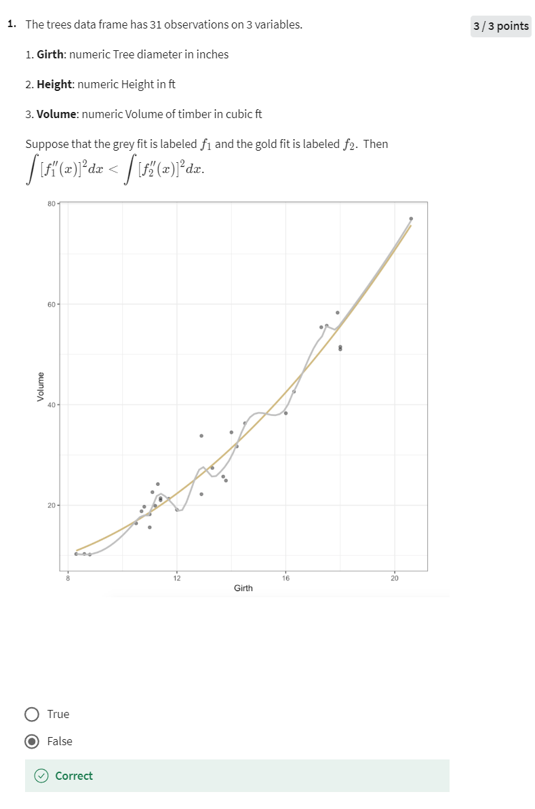
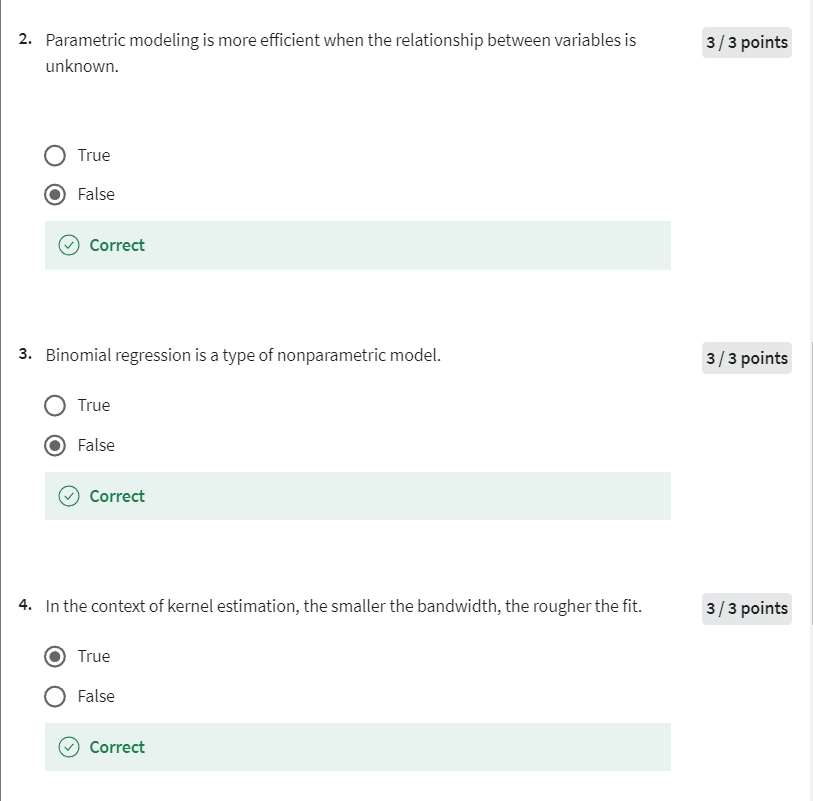
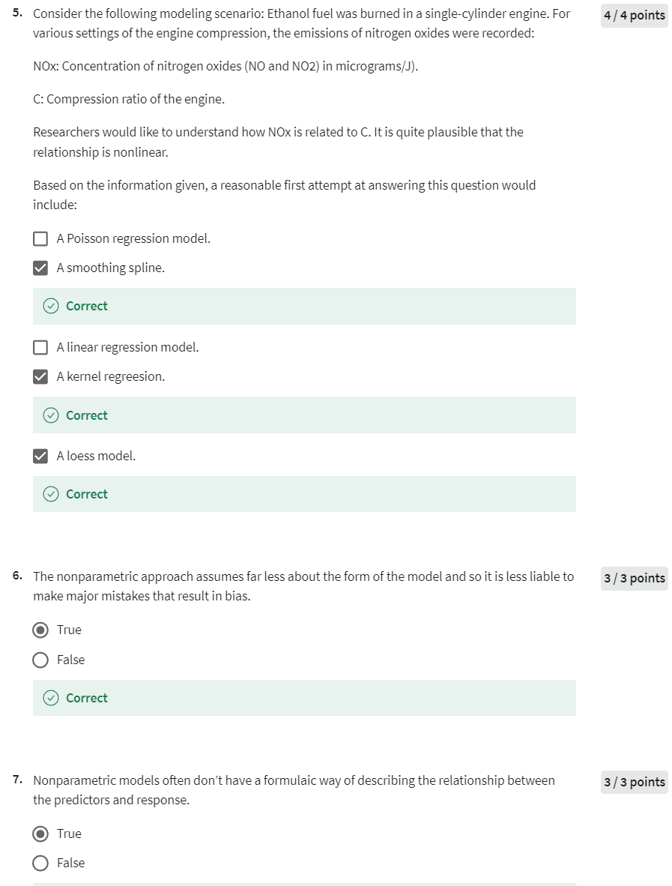
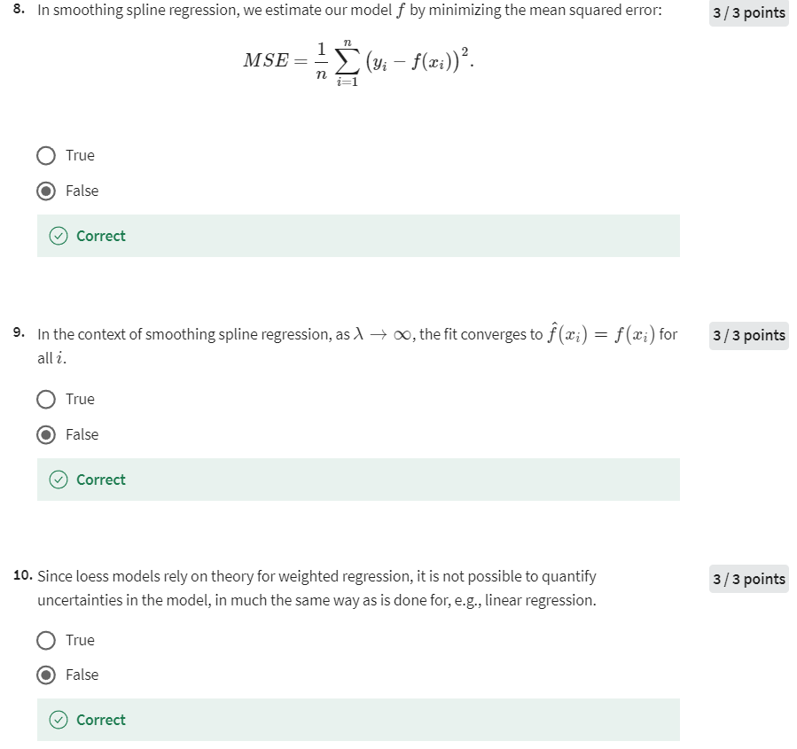
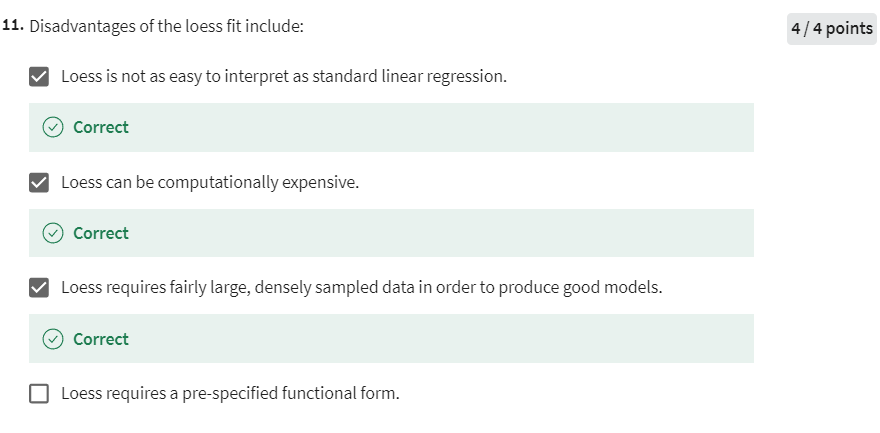

# Week 3 Quiz 1

## Quiz 1

以下是每道题的中文题目和答案解释：

### 问题 1

**题目：**
假设树木数据框有31个观测值，包含3个变量：

1. Girth：数值型，树的直径（以英寸为单位）
2. Height：数值型，高度（以英尺为单位）
3. Volume：数值型，木材的体积（以立方英尺为单位）

假设灰色拟合曲线标记为 \( f_1 \)，金色拟合曲线标记为 \( f_2 \)。那么 \( \int [f_1''(x)]^2 dx < \int [f_2''(x)]^2 dx \) 是否正确？

**答案：** False

**解释：**
如果灰色曲线更陡峭，则意味着它的二阶导数值较大，因此 \( \int [f_1''(x)]^2 dx \) 将比金色曲线更大。由于题目给出的不等式相反，因此它是错误的。

### 问题 2

**题目：**
当变量之间的关系未知时，参数模型更加高效。是否正确？

**答案：** False

**解释：**
当变量之间的关系未知时，使用参数模型可能不合适，因为参数模型假设了一个特定的函数形式，如果假设错误，可能会导致偏差。非参数模型更为灵活，能够更好地适应未知的关系，因此在这种情况下可能更有效。

### 问题 3

**题目：**
二项回归是一种非参数模型。是否正确？

**答案：** False

**解释：**
二项回归是一种参数模型，因为它假设了特定的函数形式（通常是逻辑回归模型）。它通过估计参数来拟合模型，因此属于参数模型范畴。

### 问题 4

**题目：**
在核估计的背景下，带宽越小，拟合越粗糙。是否正确？

**答案：** True

**解释：**
带宽决定了核估计的平滑度。带宽越小，模型越关注局部数据，拟合曲线可能会变得非常波动，从而变得粗糙。因此，该陈述是正确的。

### 问题 5

**题目：**
考虑以下建模情境：在一个单缸发动机中燃烧乙醇燃料。记录了不同发动机压缩比设置下的氮氧化物排放量（以微克/焦耳为单位）。

NOx：氮氧化物（NO和NO2）的浓度。

C：发动机的压缩比。

研究人员希望理解NOx与C之间的关系，这种关系可能是非线性的。

基于给定的信息，合理的初步建模尝试应包括哪些模型？

**答案：** 平滑样条回归、线性回归、核回归、局部回归（Loess模型）。

**解释：**
题目提到的关系可能是非线性的，因此除了线性回归外，使用平滑样条、核回归和Loess模型等非线性模型都是合理的选择。这些模型可以灵活地捕捉复杂的非线性关系。

### 问题 6

**题目：**
非参数方法对模型形式的假设较少，因此不太容易因偏差而犯重大错误。是否正确？

**答案：** True

**解释：**
非参数模型不依赖于特定的函数形式，因此在模型形式未知或复杂时，可以减少模型误差和偏差的风险。相比之下，参数模型由于假设了特定形式，可能在假设错误时产生较大偏差。

### 问题 7

**题目：**
非参数模型通常没有描述预测变量与响应变量之间关系的公式化方式。是否正确？

**答案：** True

**解释：**
非参数模型不像参数模型那样明确地假设变量之间的关系。它们依赖于数据本身进行拟合，因此通常无法用一个具体的公式来描述预测变量与响应变量之间的关系。

### 问题 8

**题目：**
在平滑样条回归中，我们通过最小化均方误差（MSE）来估计模型 \( f \)：

MSE = \( \frac{1}{n} \sum_{i=1}^n (y_i - f(x_i))^2 \)

是否正确？

**答案：** False

**解释：**
平滑样条回归不仅仅是最小化均方误差（MSE），还包括一个平滑项，这个平滑项是曲线的二阶导数的平方积分。因此，单独使用均方误差来估计模型是不准确的。

### 问题 9

**题目：**
在平滑样条回归中，当 \( \lambda \) 趋近无穷大时，拟合结果会收敛到 \( f(x_i) = y_i \) 对所有 \( i \) 成立。是否正确？

**答案：** False

**解释：**
当 \( \lambda \) 趋近无穷大时，平滑样条将趋向于最光滑的函数，通常是一个线性函数，而不会逐点拟合数据点。因此，该陈述是错误的。

### 问题 10

**题目：**
由于Loess模型依赖于加权回归理论，因此无法像线性回归那样对模型中的不确定性进行量化。是否正确？

**答案：** False

**解释：**
虽然Loess模型使用加权回归进行拟合，但我们仍然可以通过多种方法来量化模型的不确定性，例如使用交叉验证或引导法。因此，该陈述是错误的。

### 问题 11

**题目：**
Loess拟合的缺点包括哪些？

**答案：** Loess不如标准线性回归容易解释；Loess计算量较大；Loess需要较大且密集采样的数据才能生成良好的模型。

**解释：**
Loess拟合的缺点确实包括这些，但它不需要预先指定一个函数形式。Loess模型的灵活性在于它可以局部拟合数据，而不依赖于全局的函数形式。因此，"Loess需要预先指定一个函数形式"是错误的。
