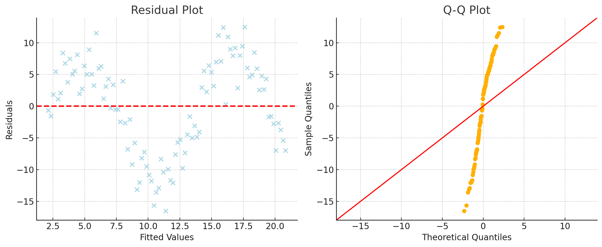

# Week 4 Note 2

Table of Contents

- [Week 4 Note 2](#week-4-note-2)
  - [Motivating Generalized Additive Models (GAMs)](#motivating-generalized-additive-models-gams)
    - [**Understanding Nonparametric Regression with Multiple Predictors**](#understanding-nonparametric-regression-with-multiple-predictors)
  - [Key Concepts](#key-concepts)
  - [推广加性模型 (GAMs) 的动机](#推广加性模型-gams-的动机)
    - [**理解具有多个预测变量的非参数回归**](#理解具有多个预测变量的非参数回归)
  - [关键概念](#关键概念)
  - [Implementing Generalized Additive Models (GAMs) in R](#implementing-generalized-additive-models-gams-in-r)
    - [**Overview**](#overview)
    - [**Step-by-Step Implementation**](#step-by-step-implementation)
    - [**Conclusion**](#conclusion)
  - [使用R实现广义加性模型 (GAMs)](#使用r实现广义加性模型-gams)
    - [**概述**](#概述)
    - [**步骤详解**](#步骤详解)
    - [**结论**](#结论)
  - [残差图（Residual Plot）与Q-Q图（Quantile-Quantile Plot）的解读](#残差图residual-plot与q-q图quantile-quantile-plot的解读)
    - [1. **残差图（Residual Plot）**](#1-残差图residual-plot)
      - [**残差图目的：**](#残差图目的)
      - [**残差图如何解读：**](#残差图如何解读)
    - [2. **Q-Q图（Quantile-Quantile Plot）**](#2-q-q图quantile-quantile-plot)
      - [**Q-Q图目的：**](#q-q图目的)
      - [**Q-Q图如何解读：**](#q-q图如何解读)
    - [图示](#图示)
    - [**总结**](#总结)

## Motivating Generalized Additive Models (GAMs)

### **Understanding Nonparametric Regression with Multiple Predictors**

1. **Introduction to the Problem:**
   - When dealing with multiple predictors, a common model is \( y_i = f(X_i) + \epsilon_i \), where \( f \) is a function of several predictors, and \( \epsilon_i \) represents the error term, typically assumed to have a mean of zero, independence, and constant variance.

2. **Additive Models:**
   - An **additive model** allows the function \( f \) to be broken down into the sum of simpler functions, each depending on a single predictor:
     \[
     f(X_i) = f_1(x_{i1}) + f_2(x_{i2}) + \dots + f_p(x_{ip})
     \]
   - **Example of Non-Additive Function:** A function with interaction terms like \( x_1 \times x_2 \times \sin^2(x_3) \) is not additive.
   - **Example of Additive Functions:** Simple sums of terms like \( x_1 + \log(0.5 \times x_1^2) + (-x_2) + x_3 \).

3. **Challenges with Nonparametric Regression:**
   - Extending nonparametric regression methods like kernel estimation to multiple predictors can be complex, especially as dimensions increase.
   - **Kernel Estimator:** In the context of multiple predictors, the kernel function becomes multivariate, and its smoothness is controlled by a matrix \( H \).

4. **Simplifying with Additive Models:**
   - Additive models simplify the complexity by assuming that the predictors enter the model additively.
   - The advantage of this approach is that it retains flexibility while allowing for easier interpretation and computation.

5. **Advantages of Additive Models:**
   - Additive models are more flexible than linear models because they do not require pre-defined transformations or polynomial terms.
   - They can accommodate both linear and non-linear relationships without needing to specify the form of the relationship in advance.

6. **Handling Specific Cases:**
   - **Linear Relationships:** If a relationship between a predictor \( x_j \) and the response \( y \) is known to be linear, it can be modeled linearly within the additive framework.
   - **Interaction Terms:** Additive models can incorporate interaction terms when necessary, but this increases complexity, especially in higher dimensions.
   - **Non-Normal Responses:** The additive model framework can be extended to non-normal responses, similar to generalized linear models (GLMs).

7. **Example: Ozone Data Analysis**
   - The video discusses a study on ozone concentration in Los Angeles, where ozone is modeled as a function of temperature, inversion base height, and inversion top temperature.
   - The additive model allows for the interpretation of marginal relationships between each predictor and ozone concentration.

8. **Conclusion:**
   - Additive models offer a powerful alternative to standard linear regression and multidimensional nonparametric regression by balancing flexibility, interpretability, and computational simplicity.

## Key Concepts

- **Additive Model:** A model where the response is a sum of functions, each depending on a single predictor.
- **Nonparametric Regression:** A type of regression that does not assume a specific form for the relationship between predictors and the response.
- **Kernel Estimation:** A method used in nonparametric regression to estimate the relationship between variables by averaging over nearby observations.
- **Matrix \( H \):** Controls the smoothness in multivariate kernel estimation, allowing different smoothing in different directions.

This lesson emphasizes the practical utility of GAMs in handling complex, multi-predictor datasets while maintaining the ability to produce interpretable results.

## 推广加性模型 (GAMs) 的动机

### **理解具有多个预测变量的非参数回归**

1. **问题的引入：**
   - 当处理多个预测变量时，常见的模型形式是 \( y_i = f(X_i) + \epsilon_i \)，其中 \( f \) 是多个预测变量的函数，\( \epsilon_i \) 表示误差项，通常假设其均值为零，彼此独立且具有相同的方差。

2. **加性模型：**
   - **加性模型** 允许函数 \( f \) 被分解为较简单的函数之和，每个函数只依赖于单个预测变量：
     \[
     f(X_i) = f_1(x_{i1}) + f_2(x_{i2}) + \dots + f_p(x_{ip})
     \]
   - **非加性函数的例子：** 包含交互项的函数，如 \( x_1 \times x_2 \times \sin^2(x_3) \)，不是加性函数。
   - **加性函数的例子：** 类似于 \( x_1 + \log(0.5 \times x_1^2) + (-x_2) + x_3 \) 的简单求和项。

3. **非参数回归的挑战：**
   - 将非参数回归方法（如核估计）扩展到多个预测变量时会变得非常复杂，尤其是在维度增加时。
   - **核估计：** 在多个预测变量的情况下，核函数变为多变量，其平滑度由一个矩阵 \( H \) 控制。

4. **通过加性模型简化问题：**
   - 加性模型通过假设预测变量以加性方式进入模型，简化了问题的复杂性。
   - 这种方法的优势在于它在保持灵活性的同时，也让模型更易于解释和计算。

5. **加性模型的优势：**
   - 加性模型比线性模型更灵活，因为它们不需要预先定义的变换或多项式项。
   - 它们可以在不预先指定关系形式的情况下，同时处理线性和非线性关系。

6. **处理特定情况：**
   - **线性关系：** 如果已知某个预测变量 \( x_j \) 与响应变量 \( y \) 之间的关系是线性的，可以在加性框架内对其进行线性建模。
   - **交互项：** 加性模型可以在必要时纳入交互项，但这会增加复杂性，尤其是在高维度下。
   - **非正态响应：** 加性模型框架可以扩展到非正态响应，类似于广义线性模型（GLMs）。

7. **示例：臭氧数据分析**
   - 视频讨论了洛杉矶臭氧浓度的研究，其中臭氧浓度被建模为温度、逆温层高度和逆温层顶温度的函数。
   - 加性模型允许解释每个预测变量与臭氧浓度之间的边际关系。

8. **总结：**
   - 加性模型通过平衡灵活性、可解释性和计算简便性，提供了标准线性回归和多维非参数回归的有力替代方案。

## 关键概念

- **加性模型：** 响应变量是函数之和，每个函数只依赖于单个预测变量。
- **非参数回归：** 一种不假设预测变量与响应变量之间具有特定形式关系的回归方法。
- **核估计：** 在非参数回归中，通过对邻近观测值进行加权平均来估计变量之间关系的方法。
- **矩阵 \( H \)：** 在多变量核估计中控制平滑度，允许在不同方向上进行不同的平滑处理。

本节课强调了GAM在处理复杂的多预测变量数据集时的实用性，同时保持了生成可解释结果的能力。

## Implementing Generalized Additive Models (GAMs) in R

### **Overview**

In this video, we learn how to implement Generalized Additive Models (GAMs) in R, specifically using the `mgcv` package. We compare the performance of GAMs with other regression methods and demonstrate how, under certain conditions, GAMs can outperform these methods. The video is accompanied by a Jupyter notebook that walks through a simulation example, helping to understand the intricacies of the GAM function.

### **Step-by-Step Implementation**

1. **Generating the Simulated Dataset:**
   - The goal is to create a dataset with different types of predictors, including a factor variable and two continuous variables.
   - \( X_1 \) is a continuous predictor with a nonlinear relationship to the response variable.
   - \( X_2 \) is a continuous predictor with a linear relationship to the response variable.
   - \( X_3 \) is a factor variable with three levels (A, B, C).

2. **Constructing the Response Variable:**
   - The response variable \( Y \) is modeled as a nonlinear function of \( X_1 \) (wrapped in a sine function) and a linear function of \( X_2 \), with an additional effect from the factor variable.

3. **Analyzing Marginal Relationships:**
   - The data is split by the factor variable \( X_3 \), and a LOESS (Locally Weighted Smoothing) model is fitted to explore the relationships between \( X_1 \) and \( Y \), as well as \( X_2 \) and \( Y \).
   - While the plots suggest a nonlinear relationship between \( X_1 \) and \( Y \), the relationship between \( X_2 \) and \( Y \) is actually linear, as expected.

4. **Fitting a Linear Model:**
   - A basic linear model is fitted to the data, but it fails to capture the nonlinear relationship between \( X_1 \) and \( Y \). This results in a high \( p \)-value and poor model performance.
   - Diagnostic plots, such as residual plots and Q-Q plots, reveal that the linear model does not fit the data well, particularly in capturing the nonlinear relationship.

5. **Fitting the True Model:**
   - The true model, which perfectly matches the simulated data's relationships, is fitted, resulting in a much better fit with lower Mean Squared Error (MSE) and statistically significant parameters.

6. **Implementing the GAM:**
   - The `mgcv` package is loaded, and the `gam` function is used to fit a GAM.
   - The model allows for a nonlinear fit for \( X_1 \) by using the `S()` function while treating \( X_2 \) as a linear predictor.
   - Diagnostic checks, including residual plots, Q-Q plots, and predicted vs. actual values plots, show that the GAM performs very well, closely approximating the true relationship and significantly outperforming the simple linear model.

### **Conclusion**

- GAMs are effective in capturing nonlinear relationships, even when the true relationship is unknown. In this case, the GAM's prediction performance was close to that of the true model and much better than a basic linear model.
- This tutorial provides the basics of working with GAMs in R, and further lessons will explore inference techniques with GAMs and offer more practice with real-world data.

## 使用R实现广义加性模型 (GAMs)

### **概述**

在本视频中，我们学习如何在R中实现广义加性模型（GAMs），特别是使用`mgcv`包。我们将GAM与其他回归方法进行比较，并展示在某些情况下，GAM的表现会更为优越。视频提供了一个Jupyter笔记本，用于模拟示例，帮助理解GAM函数的细节。

### **步骤详解**

1. **生成模拟数据集：**
   - 构建具有不同类型预测变量的数据集，包括一个因子变量和两个连续变量。
   - \( X_1 \) 是连续预测变量，与响应变量之间存在非线性关系。
   - \( X_2 \) 是连续预测变量，与响应变量之间存在线性关系。
   - \( X_3 \) 是一个具有三个水平（A、B、C）的因子变量。

2. **构造响应变量：**
   - 响应变量 \( Y \) 是 \( X_1 \) 的非线性函数（包裹在正弦函数内）和 \( X_2 \) 的线性函数的组合，同时加上因子变量的影响。

3. **边际关系分析：**
   - 将数据按因子变量 \( X_3 \) 分组，并使用局部加权回归（LOESS）来拟合 \( X_1 \) 和 \( X_2 \) 与响应变量之间的关系。
   - 尽管图表显示了 \( X_1 \) 和 \( Y \) 之间的非线性关系，但实际中 \( X_2 \) 和 \( Y \) 之间的关系是线性的。

4. **线性模型拟合：**
   - 通过线性模型拟合数据，但由于 \( X_1 \) 与 \( Y \) 之间存在非线性关系，模型未能很好地捕捉到这种关系，导致 \( p \)-值高，回归效果不佳。
   - 通过残差图和Q-Q图检查模型的拟合质量，发现线性模型未能很好地拟合数据，尤其是未能处理非线性关系。

5. **真实模型的拟合：**
   - 采用与真实关系完全一致的模型进行拟合，得到了更好的拟合效果和较低的均方误差（MSE），并验证了模型参数的显著性。

6. **GAM的实现：**
   - 加载`mgcv`包并使用`gam`函数拟合GAM模型。
   - 允许对 \( X_1 \) 进行非线性拟合（通过`S()`函数），而对 \( X_2 \) 进行线性拟合。
   - 检查GAM模型的残差、Q-Q图和预测值与实际值的关系图，结果表明GAM模型在捕捉非线性关系方面表现良好。

### **结论**

- GAM在没有先验信息的情况下能够很好地捕捉非线性关系，并且在本案例中，其预测效果接近于真实模型，大大优于简单的线性模型。
- 本次学习为在R中使用GAM提供了基本操作方法，后续课程将进一步探讨GAM的推断技术，并在实际数据上进行更多实践。

## 残差图（Residual Plot）与Q-Q图（Quantile-Quantile Plot）的解读

**残差图和Q-Q图是模型诊断的重要工具，用于评估模型的拟合效果和假设的合理性。以下是如何解读这两种图表的简要说明：**

### 1. **残差图（Residual Plot）**

#### **残差图目的：**

- 用于检查模型是否存在系统性的误差，即模型拟合是否存在偏差。
- 通过残差图，可以查看残差是否均匀分布，是否有任何明显的模式或趋势。

#### **残差图如何解读：**

- **理想情况：** 残差图中，残差应随机分布在零附近，没有明显的模式或趋势。如果残差图表现为随机的云状分布，则表明模型拟合得比较好，没有系统性的误差。
- **常见问题：**
  - **非线性模式：** 如果残差图中出现明显的曲线或波动模式，说明模型未能捕捉到数据中的非线性关系，可能需要考虑更复杂的模型（例如加入非线性项或使用GAM）。
  - **异方差性：** 如果残差的散布程度随着预测值的变化而变化（例如，预测值增加时残差也增加），这表明存在异方差性。此时，模型假设的等方差性被违反，可能需要使用加权回归或其他方法来处理。
  - **离群点或异常值：** 如果某些残差明显偏离其他残差，可能存在离群点，需要进一步检查这些数据点是否异常。

### 2. **Q-Q图（Quantile-Quantile Plot）**

#### **Q-Q图目的：**

- 用于评估残差是否符合正态分布，这是线性回归模型的一项重要假设。

#### **Q-Q图如何解读：**

- **理想情况：** 如果残差是正态分布的，Q-Q图中的点应沿着45度对角线排列。点与线的吻合程度越高，残差的分布就越接近正态分布。
- **常见问题：**
  - **尾部偏差（Fat Tails）：** 如果在Q-Q图的两端（尾部）出现点偏离对角线的情况，说明残差在分布的尾部偏离了正态分布，可能存在重尾或极端值。
  - **中心偏差：** 如果在Q-Q图的中间部分出现点偏离对角线的情况，可能表明残差的分布中存在偏度，正态分布假设被违反。
  - **整体偏差：** 如果Q-Q图中大部分点都偏离了对角线，这意味着残差可能遵循非正态分布，这可能需要对残差进行变换或考虑使用更稳健的模型。

### 图示

图示以及相应的中文说明：

1. **残差图（左图）：**
   - 这个图显示了残差（误差）相对于拟合值的分布情况。理想情况下，残差应该随机散布在零附近的水平线上，没有明显的模式，这表明模型很好地捕捉到了数据中的关系。
   - 在这个例子中，你可以观察到一些模式，这暗示模型可能没有完全捕捉到数据中的非线性关系。

2. **Q-Q图（右图）：**
   - Q-Q图用于将残差的分布与正态分布进行比较。如果残差符合正态分布，点应该沿着45度对角线排列。
   - 在这里，图中的点在尾部有一些偏离对角线的现象，这表明残差可能并不完全符合正态分布。

这些图对于诊断模型中的潜在问题非常重要，比如非线性、异方差性或非正态残差等问题。这些图帮助我们识别模型拟合中的不足之处，从而进一步改进模型。

### **总结**

- **残差图**是检测模型拟合是否存在偏差或模式的工具，而**Q-Q图**则用于检查残差的分布是否符合正态分布假设。这两者结合使用，可以帮助你识别模型潜在的问题，从而改进模型或选择更合适的分析方法。
