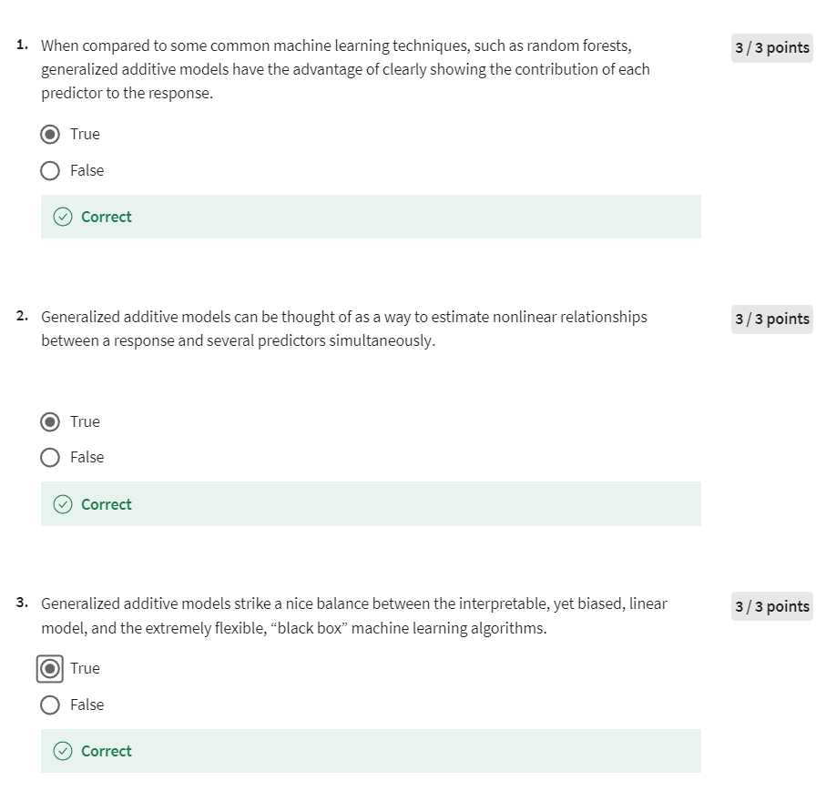
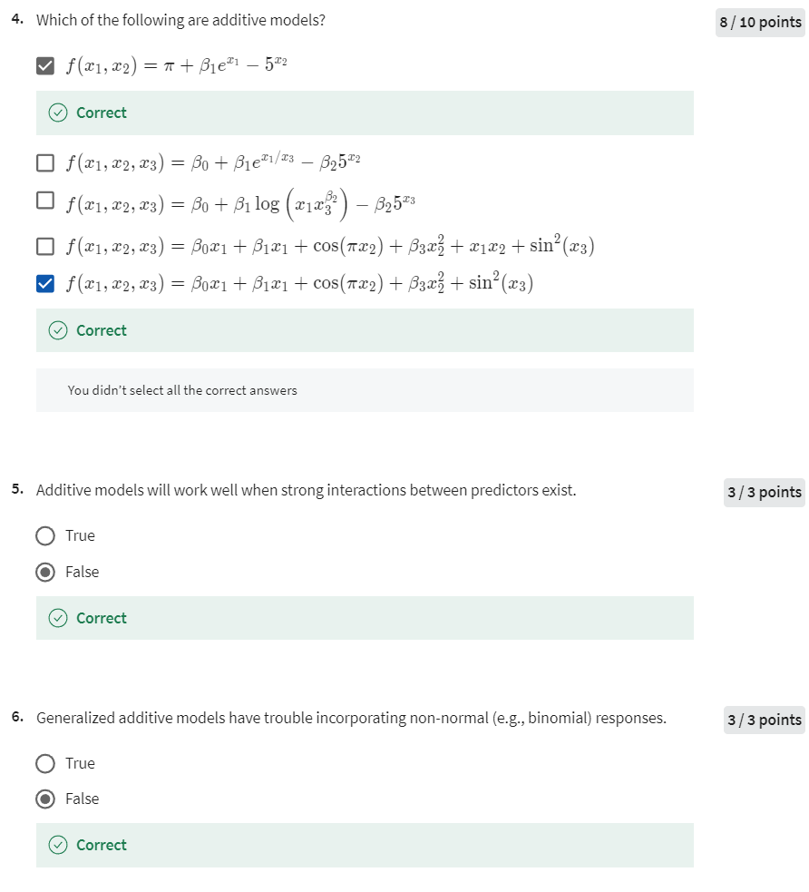
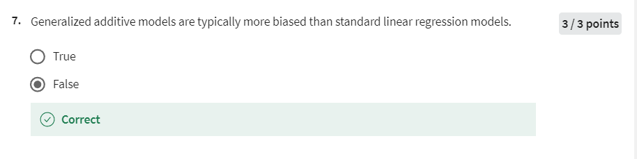
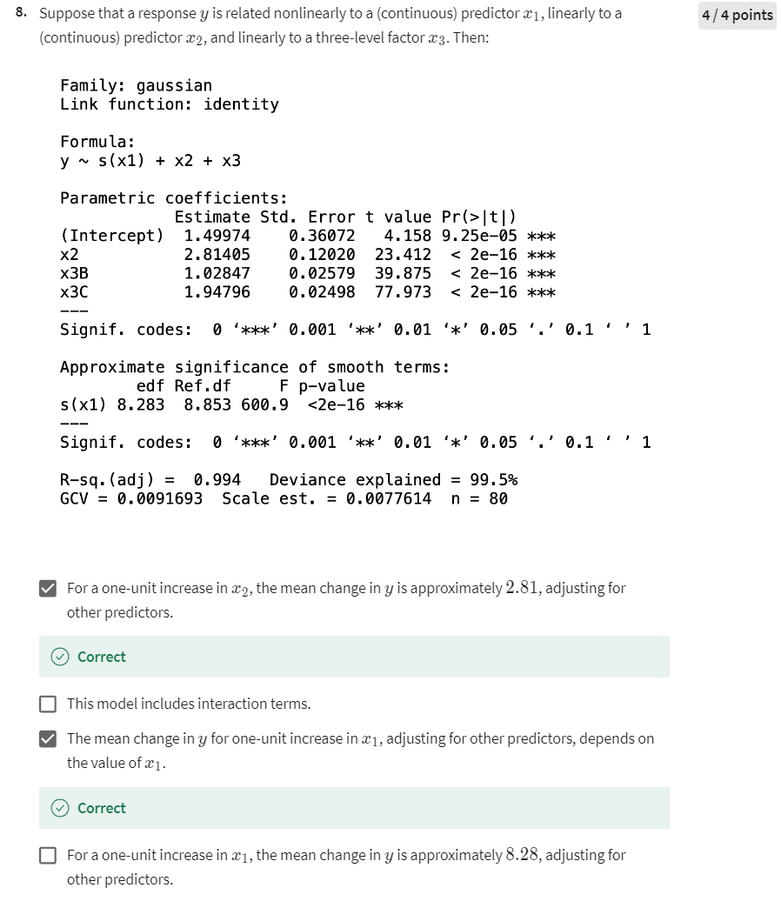

# Week 4 Quiz 1

## Quiz 1

以下是每道题目的整理和解答，包括不正确的多选选项的解答：

### 1. **Question 1**

**When compared to some common machine learning techniques, such as random forests, generalized additive models have the advantage of clearly showing the contribution of each predictor to the response.**

- **正确答案**: True
- **解答**: 广义加性模型（GAMs）的一个显著优势是，它能够清晰地展示每个预测变量对响应变量的贡献，这是与一些机器学习技术（如随机森林）相比的优势。GAMs 提供了易于解释的模型形式。

### 2. **Question 2**

**Generalized additive models can be thought of as a way to estimate nonlinear relationships between a response and several predictors simultaneously.**

- **正确答案**: True
- **解答**: GAMs 确实可以用于同时估计响应变量与多个预测变量之间的非线性关系。它们允许每个预测变量以平滑函数的形式单独影响响应变量。

### 3. **Question 3**

**Generalized additive models strike a nice balance between the interpretable, yet biased, linear model, and the extremely flexible, “black box” machine learning algorithms.**

- **正确答案**: True
- **解答**: GAMs 在可解释性和灵活性之间取得了良好的平衡。它们比线性模型更灵活，但又不像某些机器学习算法（如神经网络或随机森林）那样难以解释。

### 4. **Question 4**

**Which of the following are additive models?**

- **选项**:
  1. \(f(x_1, x_2) = \pi + \beta_1 e^{x_1} - 5x_2\) - **正确**
  2. \(f(x_1, x_2, x_3) = \beta_0 + \beta_1 \frac{e^{x_1}}{x_3} - \beta_2 5x_2\) - **错误**

3. \(f(x_1, x_2, x_3) = \beta_0 + \beta_1 \log(x_1 x_3^{\beta_2}) - \beta_2 5x_3\) - **正确** $log(x1 * x3^beta2) = log(x1) + beta2 * log(x3)$
4. \(f(x_1, x_2, x_3) = \beta_0 x_1 + \beta_1 x_1 + \cos(\pi x_2) + \beta_3 x_2^2 + x_1 x_2 + \sin^2(x_3)\) - **错误**
5. \(f(x_1, x_2, x_3) = \beta_0 x_1 + \beta_1 x_1 + \cos(\pi x_2) + \beta_3 x_2^2 + \sin^2(x_3)\) - **正确**

- **正确答案**: 选项 1 3 和 5
- **解答**: 加性模型是指响应变量是预测变量的加性组合，不允许预测变量之间的乘积项或复杂的非线性交互项。选项 1 和 5 是符合加性模型定义的，而选项 2和 4 含有非加性成分或交互项。

### 5. **Question 5**

**Additive models will work well when strong interactions between predictors exist.**

- **正确答案**: False
- **解答**: 加性模型假设每个预测变量对响应变量的影响是独立的。因此，当存在强交互效应时，加性模型可能无法很好地捕捉这些交互效应。

### 6. **Question 6**

**Generalized additive models have trouble incorporating non-normal (e.g., binomial) responses.**

- **正确答案**: False
- **解答**: GAMs 可以处理非正态响应变量（例如二项分布或泊松分布）的问题。这是通过使用适当的链接函数和分布族来实现的，因此这道题的答案是错误的。

### 7. **Question 7**

**Generalized additive models are typically more biased than standard linear regression models.**

- **正确答案**: False
- **解答**: GAMs 通常比标准线性回归模型更灵活，可以捕捉到更复杂的非线性关系，因此它们不一定会比线性模型有更高的偏差。这道题的答案是错误的。

### 8. **Question 8**

**Suppose that a response \(y\) is related nonlinearly to a (continuous) predictor \(x_1\), linearly to a (continuous) predictor \(x_2\), and linearly to a three-level factor \(x_3\). Then:**

- **选项**:
  1. For a one-unit increase in \(x_2\), the mean change in \(y\) is approximately 2.81, adjusting for other predictors. - **正确**
  2. This model includes interaction terms. - **错误**
  3. The mean change in \(y\) for one-unit increase in \(x_1\), adjusting for other predictors, depends on the value of \(x_1\). - **正确**
  4. For a one-unit increase in \(x_1\), the mean change in \(y\) is approximately 8.28, adjusting for other predictors. - **错误**

- **正确答案**: 选项 1 和 3
- **解答**:
  - 选项 1 是正确的，因为 \(x_2\) 的系数为 2.81，表示在控制其他预测变量后，\(x_2\) 增加一个单位，\(y\) 的均值增加约 2.81。
  - 选项 2 是错误的，因为模型没有包含交互项。
  - 选项 3 是正确的，因为 \(x_1\) 和 \(y\) 之间的关系是非线性的，意味着 \(x_1\) 对 \(y\) 的影响取决于 \(x_1\) 的具体值。
  - 选项 4 是错误的，因为 8.28 不是 \(x_1\) 增加一个单位时的均值变化，而是平滑函数 \(s(x1)\) 的有效自由度。

### 9. **Question 9**

根据问题中的描述，以及基于你之前提供的模型输出，以下是对每个选项的解答：

1. **For a one-unit increase in \(x_2\), the mean change in \(y\) is approximately 2.81, adjusting for other predictors.**

   - **正确**。模型中的线性项 \(x_2\) 的估计系数是 2.81405，表示在调整其他预测变量后，\(x_2\) 增加一个单位，\(y\) 的均值大约增加 2.81。

2. **This model includes interaction terms.**

   - **错误**。根据提供的模型公式 \(y \sim s(x1) + x2 + x3\)，该模型不包含交互项。模型中只有非线性项（\(s(x1)\)）和线性项（\(x2\) 和 \(x3\)），但没有交互项。

3. **The mean change in \(y\) for one-unit increase in \(x_1\), adjusting for other predictors, depends on the value of \(x_1\).**

   - **正确**。因为 \(x_1\) 是通过平滑函数 \(s(x1)\) 非线性建模的，所以 \(x_1\) 对 \(y\) 的影响取决于 \(x_1\) 的具体值。

4. **For a one-unit increase in \(x_1\), the mean change in \(y\) is approximately 8.28, adjusting for other predictors.**

   - **错误**。虽然 8.28 出现在模型输出中，但它是指平滑函数 \(s(x1)\) 的有效自由度（edf），而不是 \(x_1\) 增加一个单位时 \(y\) 的平均变化量。由于 \(x_1\) 与 \(y\) 的关系是非线性的，因此 \(x_1\) 增加一个单位时 \(y\) 的变化量是动态的，并不恒定。

因此，正确的选项是：

- **For a one-unit increase in \(x_2\), the mean change in \(y\) is approximately 2.81, adjusting for other predictors.**
- **The mean change in \(y\) for one-unit increase in \(x_1\), adjusting for other predictors, depends on the value of \(x_1\).**
在你提供的模型输出中，我们可以看到回归分析中的几个关键统计量，包括回归系数、标准误差、t 值以及 p 值。下面是对这些统计量的详细解释，特别是 t 值的意义。

### 1. **模型信息**

- **Family: gaussian**: 使用了正态分布作为模型的误差分布。
- **Link function: identity**: 使用了恒等链接函数，意味着线性关系被直接建模。

### 2. **公式**

- **Formula: y ~ s(x1) + x2 + x3**: 说明模型中响应变量 \( y \) 由光滑函数 \( s(x1) \)（针对 \( x1 \) 的非线性平滑）、线性变量 \( x2 \) 和因子变量 \( x3 \) 进行预测。

### 3. **参数估计（Parametric coefficients）**

- **(Intercept)**: 截距项的估计值为 1.49974。
- **x2**: 变量 \( x2 \) 的估计系数为 2.81405。
- **x3B, x3C**: 因子变量 \( x3 \) 的两个水平 B 和 C 的系数分别为 1.02847 和 1.94796。

### 4. **t 值（t value）**

- **t 值的定义和计算**:
  - t 值是由回归系数除以其标准误差得出的，即：
    \[
    t = \frac{\text{Estimate}}{\text{Std. Error}}
    \]
  - t 值衡量的是每个自变量对响应变量的影响强度。t 值越大，表示该回归系数相对于其标准误差来说越大，表明该自变量对模型的影响越显著。
  
- **解读示例**:
  - **x2 的 t 值**: 在输出中，\( x2 \) 的 t 值是 23.412。这是一个非常大的 t 值，表明 \( x2 \) 与响应变量 \( y \) 之间存在显著的线性关系。进一步，p 值 (< 2e-16) 也非常低，这表明在常用的显著性水平下（如 0.05），我们可以自信地说 \( x2 \) 对模型的贡献是显著的。
  - **x3B 和 x3C 的 t 值**: 类似地，x3B 和 x3C 的 t 值分别为 39.875 和 77.973，这些值也非常大，表明 \( x3 \) 的这些水平对响应变量有显著影响。

### 5. **平滑项的近似显著性（Approximate significance of smooth terms）**

- **s(x1)**: 变量 \( x1 \) 的平滑函数的 t 值和 F 统计量显示了它在模型中具有显著的非线性关系。

### 6. **模型整体统计量**

- **R-sq.(adj) = 0.994**: 调整后的 \( R^2 \) 为 0.994，表明模型解释了响应变量 99.4% 的变异，模型拟合非常好。
- **Deviance explained = 99.5%**: 偏差解释率为 99.5%，进一步说明了模型的高拟合度。
- **GCV = 0.0091693**: 广义交叉验证得分为 0.0091693，表明模型具有良好的预测能力。

### **总结**

- 该模型非常显著，具有极高的解释力。t 值显示了模型中自变量对响应变量的显著性，特别是 \( x2 \) 和因子 \( x3 \) 的两个水平 B 和 C。平滑项 \( s(x1) \) 表明 \( x1 \) 与响应变量之间存在显著的非线性关系，模型的整体拟合度非常高。
