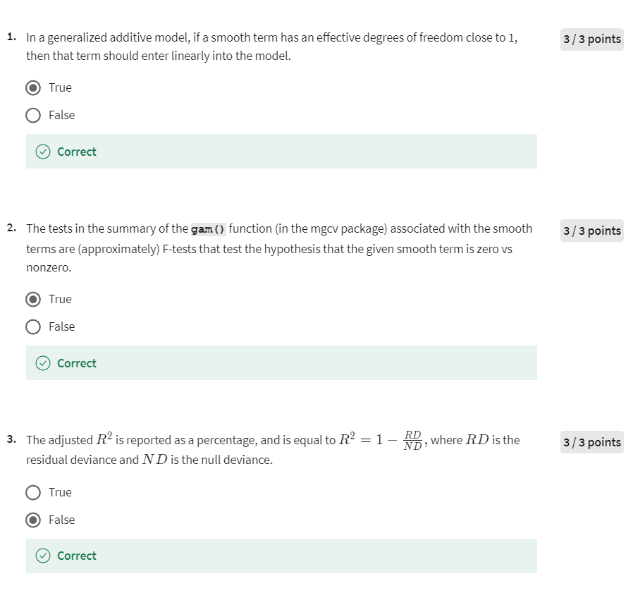
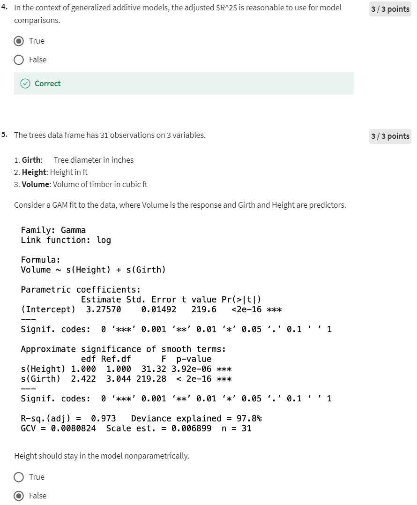
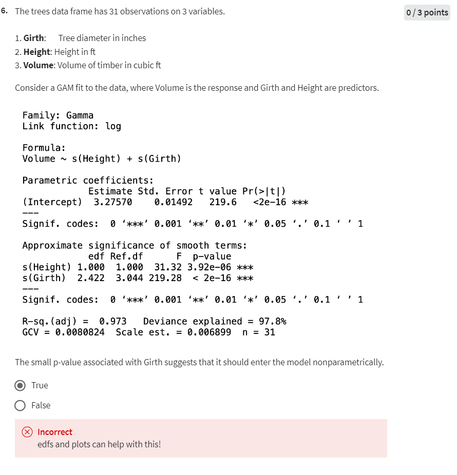

# Week 4 Quiz 2

## Quiz 2

### 1. 问题 1

**陈述：** 在广义加性模型中，如果一个平滑项的有效自由度接近1，那么该项应以线性方式进入模型。

**答案：** 正确

**解释：**  
在广义加性模型（GAM）中，平滑项的有效自由度（EDF）表示预测变量与响应变量之间关系的复杂性。如果EDF接近1，这表明预测变量与响应变量之间的关系大致为线性。在这种情况下，将该项以线性方式引入模型可能更为合适，而不是应用平滑函数来捕捉非线性关系。

### 2. 问题 2

**陈述：** 在`mgcv`包的`gam()`函数的总结输出中，与平滑项相关的检验是（近似的）F检验，用于检验给定平滑项是否为零对非零的假设。

**答案：** 正确

**解释：**  
在R语言的`mgcv`包中，广义加性模型（GAM）的总结输出为平滑项提供了近似的F检验。这些检验用于评估平滑项是否对模型有显著贡献。零假设（H0）是平滑项为零（即没有贡献），而备择假设（H1）是平滑项非零，这意味着它对响应变量有显著影响。

### 3. 问题 3

**陈述：** 调整后的 \(R^2\) 以百分比形式报告，并等于 \(R^2 = 1 - \frac{RD}{ND}\)，其中 \(RD\) 是残差偏差，\(ND\) 是空偏差。

**答案：** 错误

**解释：**  
调整后的 \(R^2\) 并不是以百分比形式报告的，且其计算方式也不是 \(R^2 = 1 - \frac{RD}{ND}\)。相反，调整后的 \(R^2\) 会根据模型中预测变量的数量相对于观测值的数量进行调整，惩罚不必要的预测变量，避免模型的解释力虚高。所提供的公式实际上与偏差解释率的计算有关，与调整后的 \(R^2\) 不同。

### 4. 问题 4

**陈述：** 在广义加性模型的背景下，调整后的 \(R^2\) 用于模型比较是合理的。

**答案：** 正确

**解释：**  
调整后的 \(R^2\) 是比较模型时的一个有用指标，包括在广义加性模型（GAMs）中。它对预测变量的数量和模型复杂性进行了调整，使其比普通 \(R^2\) 更加可靠，尤其是在比较不同复杂度的模型时。调整后的 \(R^2\) 值越高，通常表示模型拟合得越好。

### 5. 问题 5

**陈述：** 树木数据框有31个观测值和3个变量。考虑拟合一个GAM模型，其中Volume为响应变量，Girth和Height为预测变量。Height应以非参数方式保留在模型中。

**答案：** 错误

**解释：**  
在这个GAM模型中，Height的平滑项的有效自由度（EDF）为1.000，表明Height与Volume之间的关系基本为线性。因此，不需要将Height作为非参数项（平滑项）保留在模型中，它可以线性地进入模型。

### 6. 问题 6

**陈述：** 树木数据框有31个观测值和3个变量。考虑拟合一个GAM模型，其中Volume为响应变量，Girth和Height为预测变量。与Girth相关的小p值表明它应以非参数方式进入模型。

**答案：** 错误

**解释：**  
虽然小p值表明Girth在预测Volume时具有统计显著性，但这并不一定意味着Girth应该以非参数方式进入模型。决定是否将一个变量以平滑项方式处理，不仅要看p值，还要看有效自由度（EDF）。在这种情况下，Girth的EDF为2.422，表明存在一定的非线性，但这并不意味着必须非参数化。因此，尽管p值很小，但不能仅凭这一点决定将其非参数化。

是的，**第六题的核心意思**是：**仅凭 p 值不足以判断一个变量是否应该以非参数方式（即通过平滑项）进入模型。**

### 详细解释

1. **p 值的作用：**
   - p 值用于测试变量在模型中的统计显著性。一个很小的 p 值表明该变量在模型中对响应变量有显著的影响。
   - 但是，p 值**并不能**告诉我们这个影响是线性还是非线性的，也不能决定该变量是否需要平滑处理。

2. **有效自由度（EDF）的作用：**
   - EDF 用于衡量变量的平滑项的复杂性。如果 EDF 接近1，通常表示该变量与响应变量的关系接近线性；如果 EDF 明显大于1，则表明存在显著的非线性关系。
   - EDF 提供了关于是否需要平滑处理的更直接信息。

3. **图形化结果的作用：**
   - 通过生成变量的边际关系图（如使用 `plot.gam()` 函数），你可以直观地看到变量与响应变量之间的关系是线性的还是非线性的。
   - 图形化结果能够帮助确认 EDF 提示的非线性关系，并让你更有信心决定是否需要平滑项。

### **第六题总结：**

- **正确答案是“False”**，因为在做出是否将 Girth 变量非参数化的决策时，不能仅依赖 p 值。你需要同时考虑 EDF 和图形化结果。
- 换句话说，即使 Girth 的 p 值很小，但如果 EDF 接近1，且图形化结果显示 Girth 与响应变量之间的关系大致线性，那么 Girth 仍然可以线性化处理，而不需要使用平滑项。

### 1. Question 1

**Statement:** In a generalized additive model, if a smooth term has an effective degrees of freedom close to 1, then that term should enter linearly into the model.

**Answer:** True

**Explanation:**  
In a generalized additive model (GAM), the effective degrees of freedom (EDF) of a smooth term indicate the complexity of the relationship between the predictor and the response. If the EDF is close to 1, it suggests that the relationship between the predictor and the response is approximately linear. In such cases, it may be more appropriate to enter the term linearly into the model rather than applying a smooth function, which is meant to capture non-linear relationships.

### 2. Question 2

**Statement:** The tests in the summary of the `gam()` function (in the `mgcv` package) associated with the smooth terms are (approximately) F-tests that test the hypothesis that the given smooth term is zero vs nonzero.

**Answer:** True

**Explanation:**  
In the `mgcv` package in R, the summary of a GAM model provides approximate F-tests for the smooth terms. These tests evaluate whether the smooth term significantly contributes to the model. The null hypothesis (H0) is that the smooth term is zero (i.e., no contribution), while the alternative hypothesis (H1) is that the smooth term is nonzero, meaning it has a significant effect on the response variable.

### 3. Question 3

**Statement:** The adjusted \(R^2\) is reported as a percentage and is equal to \(R^2 = 1 - \frac{RD}{ND}\), where \(RD\) is the residual deviance and \(ND\) is the null deviance.

**Answer:** False

**Explanation:**  
Adjusted \(R^2\) is not reported as a percentage, nor is it calculated using the formula \(R^2 = 1 - \frac{RD}{ND}\). Instead, adjusted \(R^2\) accounts for the number of predictors in the model relative to the number of observations, penalizing the addition of unnecessary predictors that do not improve the model's explanatory power. The formula provided is related to the calculation of deviance explained, which is different from adjusted \(R^2\).

### 4. Question 4

**Statement:** In the context of generalized additive models, the adjusted \(R^2\) is reasonable to use for model comparisons.

**Answer:** True

**Explanation:**  
Adjusted \(R^2\) is a useful metric for comparing models, including generalized additive models (GAMs). It adjusts for the number of predictors and the complexity of the model, making it a more reliable measure than regular \(R^2\) when comparing models with different numbers of predictors or different degrees of complexity. A higher adjusted \(R^2\) generally indicates a better-fitting model.

### 5. Question 5

**Statement:** The trees data frame has 31 observations on 3 variables. Consider a GAM fit to the data, where Volume is the response and Girth and Height are predictors. Height should stay in the model nonparametrically.

**Answer:** False

**Explanation:**  
In the context of this GAM, the smooth term for Height has an effective degrees of freedom (EDF) of 1.000, indicating that the relationship between Height and Volume is essentially linear. Therefore, there is no need to keep Height in the model as a nonparametric term (smooth term); it can be entered linearly.

### 6. Question 6

**Statement:** The trees data frame has 31 observations on 3 variables. Consider a GAM fit to the data, where Volume is the response and Girth and Height are predictors. The small p-value associated with Girth suggests that it should enter the model nonparametrically.

**Answer:** False

**Explanation:**  
While a small p-value indicates that Girth is statistically significant in predicting Volume, this does not necessarily imply that Girth should be modeled nonparametrically. The decision to model a term nonparametrically should be based on the effective degrees of freedom (EDF). In this case, the EDF for Girth is 2.422, suggesting some nonlinearity but not necessarily a strong case for nonparametric modeling. Therefore, despite the small p-value, the decision to smooth Girth should consider both the p-value and the EDF, rather than the p-value alone.
